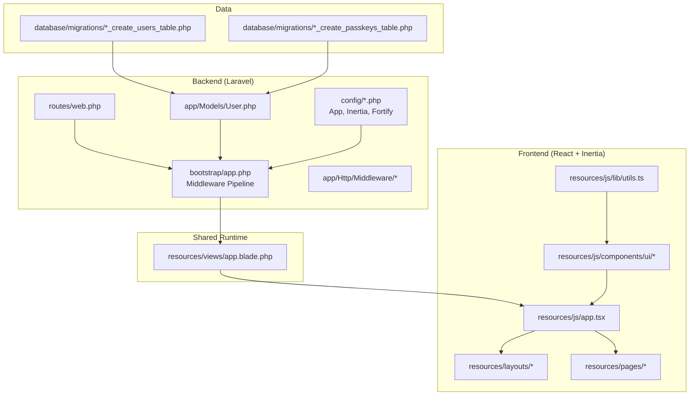
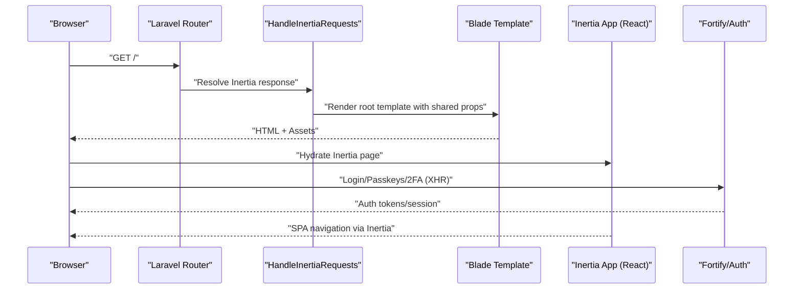
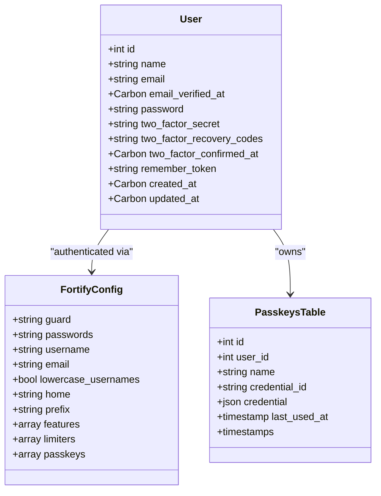
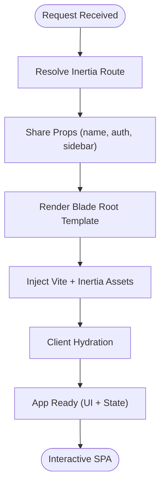
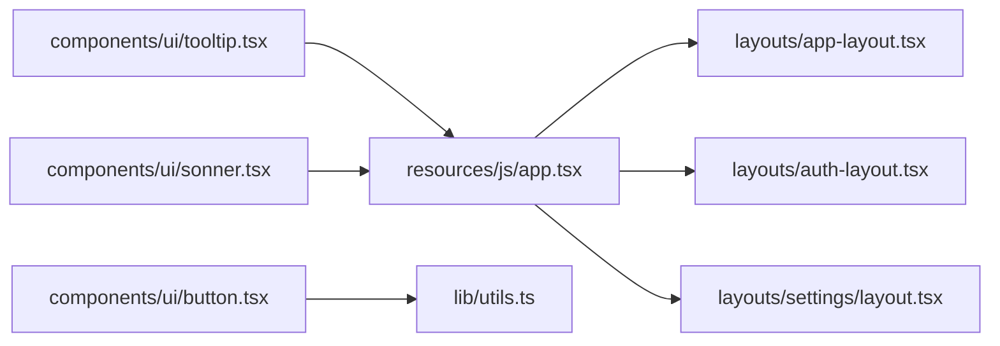
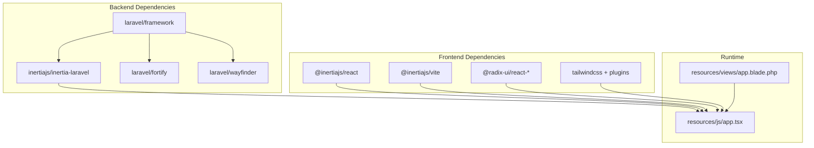

# Technical Vision & Architecture

<cite>
**Referenced Files in This Document**
- [composer.json](file://composer.json)
- [package.json](file://package.json)
- [bootstrap/app.php](file://bootstrap/app.php)
- [config/app.php](file://config/app.php)
- [config/inertia.php](file://config/inertia.php)
- [config/fortify.php](file://config/fortify.php)
- [app/Http/Middleware/HandleInertiaRequests.php](file://app/Http/Middleware/HandleInertiaRequests.php)
- [app/Http/Middleware/HandleAppearance.php](file://app/Http/Middleware/HandleAppearance.php)
- [app/Models/User.php](file://app/Models/User.php)
- [resources/js/app.tsx](file://resources/js/app.tsx)
- [resources/views/app.blade.php](file://resources/views/app.blade.php)
- [database/migrations/0001_01_01_000000_create_users_table.php](file://database/migrations/0001_01_01_000000_create_users_table.php)
- [database/migrations/2024_01_01_000000_create_passkeys_table.php](file://database/migrations/2024_01_01_000000_create_passkeys_table.php)
- [routes/web.php](file://routes/web.php)
- [resources/js/components/ui/button.tsx](file://resources/js/components/ui/button.tsx)
- [resources/js/lib/utils.ts](file://resources/js/lib/utils.ts)
</cite>

## Table of Contents
1. [Introduction](#introduction)
2. [Project Structure](#project-structure)
3. [Core Components](#core-components)
4. [Architecture Overview](#architecture-overview)
5. [Detailed Component Analysis](#detailed-component-analysis)
6. [Dependency Analysis](#dependency-analysis)
7. [Performance Considerations](#performance-considerations)
8. [Troubleshooting Guide](#troubleshooting-guide)
9. [Conclusion](#conclusion)
10. [Appendices](#appendices)

## Introduction
ScholarGraph adopts a modern hybrid full-stack architecture that blends a Laravel backend with a React frontend powered by Inertia.js. This approach delivers a seamless Single Page App (SPA) experience while retaining server-side rendering (SSR) benefits for initial page loads and SEO. The system integrates robust authentication leveraging Laravel Fortify with WebAuthn passkeys and two-factor authentication. The UI is built atop a custom component library using Radix UI primitives and Tailwind CSS, ensuring accessibility, consistency, and responsiveness. PostgreSQL-backed persistence supports relational data and JSONB fields for flexible, evolving research metadata. Deployment and scaling considerations emphasize containerization, CDN delivery, and horizontal partitioning strategies.

## Project Structure
The repository follows a layered, feature-oriented structure:
- Backend: Laravel application with route-driven Inertia responses, middleware pipeline, and Eloquent models.
- Frontend: React application bootstrapped via Vite, with Inertia’s client adapter and a custom UI component library.
- Shared assets: Blade templates render the root HTML shell and inject Inertia page assets.
- Data: Migrations define core relational tables and JSONB-enabled passkey credentials.



**Diagram sources**
- [routes/web.php:1-12](file://routes/web.php#L1-L12)
- [bootstrap/app.php:11-30](file://bootstrap/app.php#L11-L30)
- [config/app.php:1-127](file://config/app.php#L1-L127)
- [config/inertia.php:1-71](file://config/inertia.php#L1-L71)
- [config/fortify.php:1-178](file://config/fortify.php#L1-L178)
- [app/Http/Middleware/HandleInertiaRequests.php:1-48](file://app/Http/Middleware/HandleInertiaRequests.php#L1-L48)
- [app/Http/Middleware/HandleAppearance.php:1-24](file://app/Http/Middleware/HandleAppearance.php#L1-L24)
- [app/Models/User.php:1-51](file://app/Models/User.php#L1-L51)
- [resources/js/app.tsx:1-41](file://resources/js/app.tsx#L1-L41)
- [resources/views/app.blade.php:1-49](file://resources/views/app.blade.php#L1-L49)
- [database/migrations/0001_01_01_000000_create_users_table.php:1-50](file://database/migrations/0001_01_01_000000_create_users_table.php#L1-L50)
- [database/migrations/2024_01_01_000000_create_passkeys_table.php:1-35](file://database/migrations/2024_01_01_000000_create_passkeys_table.php#L1-L35)

**Section sources**
- [composer.json:11-19](file://composer.json#L11-L19)
- [package.json:31-66](file://package.json#L31-L66)
- [bootstrap/app.php:11-30](file://bootstrap/app.php#L11-L30)
- [config/app.php:1-127](file://config/app.php#L1-L127)
- [routes/web.php:1-12](file://routes/web.php#L1-L12)

## Core Components
- Laravel Core and Routing
  - Application bootstrap configures routing, middleware, and exception handling tailored for SPA responses.
  - Routes define inertia-driven pages for home, dashboard, and settings.
- Inertia Integration
  - Server-side rendering enabled with configurable SSR endpoint.
  - Root template and shared props (application name, auth state, sidebar state) are injected for hydration.
- Authentication and Identity
  - Fortify provides registration, password reset, email verification, two-factor, and passkeys (WebAuthn) features.
  - User model integrates passkey and two-factor traits.
- Frontend Runtime
  - Inertia app bootstraps layouts, title generation, and global providers (tooltips, toast).
  - Theme initialization and cookie-driven appearance handling.
- UI Component Library
  - Custom components built with Radix UI and styled via Tailwind, using a centralized utility for class merging.

**Section sources**
- [bootstrap/app.php:11-30](file://bootstrap/app.php#L11-L30)
- [config/inertia.php:1-71](file://config/inertia.php#L1-L71)
- [app/Http/Middleware/HandleInertiaRequests.php:17-46](file://app/Http/Middleware/HandleInertiaRequests.php#L17-L46)
- [config/fortify.php:145-175](file://config/fortify.php#L145-L175)
- [app/Models/User.php:32-35](file://app/Models/User.php#L32-L35)
- [resources/js/app.tsx:11-37](file://resources/js/app.tsx#L11-L37)
- [resources/views/app.blade.php:1-49](file://resources/views/app.blade.php#L1-L49)
- [resources/js/components/ui/button.tsx:1-59](file://resources/js/components/ui/button.tsx#L1-L59)
- [resources/js/lib/utils.ts:1-13](file://resources/js/lib/utils.ts#L1-L13)

## Architecture Overview
The hybrid architecture combines server-first rendering with client-side interactivity:
- Request lifecycle begins in Laravel routes, which delegate to Inertia to render React pages.
- Blade root template injects compiled assets and initializes Inertia.
- Middleware ensures shared data and appearance preferences are available to the client.
- Authentication flows leverage Fortify endpoints and WebAuthn passkeys for passwordless, secure sign-in.



**Diagram sources**
- [routes/web.php:5-9](file://routes/web.php#L5-L9)
- [app/Http/Middleware/HandleInertiaRequests.php:36-46](file://app/Http/Middleware/HandleInertiaRequests.php#L36-L46)
- [resources/views/app.blade.php:39-46](file://resources/views/app.blade.php#L39-L46)
- [resources/js/app.tsx:11-37](file://resources/js/app.tsx#L11-L37)
- [config/fortify.php:163-175](file://config/fortify.php#L163-L175)

## Detailed Component Analysis

### Authentication Architecture (Fortify + WebAuthn)
- Fortify Features
  - Registration, password reset, email verification, two-factor authentication (with confirmation), and passkeys (WebAuthn) are enabled.
  - Rate limiting applied per-login, two-factor, and passkeys.
- WebAuthn Passkeys
  - Relaying Party ID derived from application URL; allowed origins bound to APP_URL.
  - Credential storage uses a dedicated JSONB column for flexible attestation data.
- User Model Enhancements
  - Implements passkey and two-factor traits to integrate with Fortify’s flows.
- Session and Cookies
  - Appearance cookie controls theme; sidebar state persisted via cookie for UX continuity.



**Diagram sources**
- [app/Models/User.php:32-49](file://app/Models/User.php#L32-L49)
- [config/fortify.php:145-175](file://config/fortify.php#L145-L175)
- [database/migrations/2024_01_01_000000_create_passkeys_table.php:14-24](file://database/migrations/2024_01_01_000000_create_passkeys_table.php#L14-L24)

**Section sources**
- [config/fortify.php:145-175](file://config/fortify.php#L145-L175)
- [app/Models/User.php:32-35](file://app/Models/User.php#L32-L35)
- [database/migrations/2024_01_01_000000_create_passkeys_table.php:14-24](file://database/migrations/2024_01_01_000000_create_passkeys_table.php#L14-L24)
- [app/Http/Middleware/HandleAppearance.php:17-22](file://app/Http/Middleware/HandleAppearance.php#L17-L22)

### Persistent Memory and Data Flow Patterns
- Relational Foundation
  - Users, sessions, and password reset tokens stored in normalized relational tables.
- Flexible Metadata Storage
  - Passkeys table stores attestation data in a JSONB column, enabling extensibility for evolving credential formats.
- Shared Props and Hydration
  - Inertia shares application-wide data (name, auth, sidebar state) to the client, minimizing redundant fetches.
- SSR Benefits
  - Initial page loads benefit from server-rendered HTML, improving perceived performance and SEO.



**Diagram sources**
- [app/Http/Middleware/HandleInertiaRequests.php:36-46](file://app/Http/Middleware/HandleInertiaRequests.php#L36-L46)
- [resources/views/app.blade.php:39-46](file://resources/views/app.blade.php#L39-L46)
- [resources/js/app.tsx:11-37](file://resources/js/app.tsx#L11-L37)

**Section sources**
- [database/migrations/0001_01_01_000000_create_users_table.php:14-37](file://database/migrations/0001_01_01_000000_create_users_table.php#L14-L37)
- [database/migrations/2024_01_01_000000_create_passkeys_table.php:14-24](file://database/migrations/2024_01_01_000000_create_passkeys_table.php#L14-L24)
- [app/Http/Middleware/HandleInertiaRequests.php:36-46](file://app/Http/Middleware/HandleInertiaRequests.php#L36-L46)

### Responsive UI Architecture and Custom Component Library
- Layout Composition
  - Inertia app selects layouts per route segment (welcome, auth, settings, default app).
  - Global providers wrap the app for tooltips and toast notifications.
- Component Design System
  - Components use Radix UI primitives for accessibility and composition.
  - Variants and sizes standardized via a central variant factory; class merging handled by a utility.
- Theming and Appearance
  - Appearance cookie drives theme; inline script detects OS preference when set to “system”.



**Diagram sources**
- [resources/js/app.tsx:13-33](file://resources/js/app.tsx#L13-L33)
- [resources/js/components/ui/button.tsx:7-35](file://resources/js/components/ui/button.tsx#L7-L35)
- [resources/js/lib/utils.ts:6-8](file://resources/js/lib/utils.ts#L6-L8)
- [resources/views/app.blade.php:8-20](file://resources/views/app.blade.php#L8-L20)

**Section sources**
- [resources/js/app.tsx:1-41](file://resources/js/app.tsx#L1-L41)
- [resources/js/components/ui/button.tsx:1-59](file://resources/js/components/ui/button.tsx#L1-L59)
- [resources/js/lib/utils.ts:1-13](file://resources/js/lib/utils.ts#L1-L13)
- [resources/views/app.blade.php:1-49](file://resources/views/app.blade.php#L1-L49)

### Database Design with PostgreSQL JSONB Capabilities
- Core Tables
  - users: identity and credentials.
  - password_reset_tokens: password recovery linkage.
  - sessions: HTTP state persistence.
- Passkeys Extension
  - passkeys: JSONB credential storage keyed by credential_id, indexed for efficient lookup.
- Indexing Strategy
  - Composite and selective indexes on foreign keys and identifiers to optimize joins and lookups.

```mermaid
erDiagram
USERS {
bigint id PK
string name
string email UK
timestamp email_verified_at
string password
string remember_token
timestamps
}
PASSKEYS {
bigint id PK
bigint user_id FK
string name
string credential_id UK
json credential
timestamp last_used_at
timestamps
}
USERS ||--o{ PASSKEYS : "has_many"
```

**Diagram sources**
- [database/migrations/0001_01_01_000000_create_users_table.php:14-37](file://database/migrations/0001_01_01_000000_create_users_table.php#L14-L37)
- [database/migrations/2024_01_01_000000_create_passkeys_table.php:14-24](file://database/migrations/2024_01_01_000000_create_passkeys_table.php#L14-L24)

**Section sources**
- [database/migrations/0001_01_01_000000_create_users_table.php:14-37](file://database/migrations/0001_01_01_000000_create_users_table.php#L14-L37)
- [database/migrations/2024_01_01_000000_create_passkeys_table.php:14-24](file://database/migrations/2024_01_01_000000_create_passkeys_table.php#L14-L24)

### AI Integration Architecture (Conceptual)
- Integration Pattern
  - The repository snapshot does not include AI-specific integrations. A recommended pattern is to expose a service layer that encapsulates provider interactions (e.g., OpenRouter and Qwen) behind a unified interface.
  - Responses are streamed or batch-processed and normalized for UI consumption.
- Data Flow
  - Prompt assembly, provider selection, and result normalization occur in backend services, surfaced to React via Inertia props or lightweight API endpoints.
- Extensibility
  - Configuration-driven provider switching and fallback strategies enable experimentation without frontend churn.

[No sources needed since this section provides conceptual guidance]

### Deployment Architecture and Scaling Considerations
- Build and Asset Delivery
  - Vite compiles frontend assets; Blade injects hashed bundles for cache busting.
- SSR Considerations
  - Inertia SSR enabled; ensure SSR worker availability and reverse proxy configuration.
- Sessions and State
  - Use database or Redis-backed sessions; ensure sticky sessions only if required.
- Horizontal Scaling
  - Stateless Laravel app plus shared Postgres; scale workers independently.
- Observability
  - Centralized logging, structured metrics, and tracing for both backend and SSR.

[No sources needed since this section provides general guidance]

## Dependency Analysis
External and internal dependencies shape runtime behavior and feature sets.



**Diagram sources**
- [composer.json:11-19](file://composer.json#L11-L19)
- [package.json:31-66](file://package.json#L31-L66)
- [resources/views/app.blade.php:39-46](file://resources/views/app.blade.php#L39-L46)
- [resources/js/app.tsx:1-41](file://resources/js/app.tsx#L1-L41)

**Section sources**
- [composer.json:11-19](file://composer.json#L11-L19)
- [package.json:31-66](file://package.json#L31-L66)

## Performance Considerations
- SSR and Hydration
  - Enable SSR for improved TTFB and SEO; monitor SSR worker throughput.
- Asset Bundling
  - Leverage Vite’s code splitting and lazy-loading for non-critical routes.
- Database Efficiency
  - Use JSONB indexing for passkeys; keep queries selective and add indexes on foreign keys.
- Middleware Overhead
  - Minimize shared prop computation; cache infrequent data where appropriate.
- Network Resilience
  - Implement retry/backoff for external integrations; provide optimistic updates with rollback paths.

[No sources needed since this section provides general guidance]

## Troubleshooting Guide
- Authentication Issues
  - Verify Fortify features and passkeys configuration; check relying party ID and allowed origins against APP_URL.
  - Confirm two-factor and passkey cookies are being set and read correctly.
- SSR Hydration Mismatches
  - Ensure Blade template and Inertia props align; avoid mutating shared data after initial render.
- Theme and Appearance
  - Confirm appearance cookie presence and inline script behavior for system preference detection.
- Database Migrations
  - Validate passkeys JSONB column exists and is indexed; check foreign key constraints.

**Section sources**
- [config/fortify.php:145-175](file://config/fortify.php#L145-L175)
- [resources/views/app.blade.php:8-20](file://resources/views/app.blade.php#L8-L20)
- [database/migrations/2024_01_01_000000_create_passkeys_table.php:14-24](file://database/migrations/2024_01_01_000000_create_passkeys_table.php#L14-L24)

## Conclusion
ScholarGraph’s architecture balances developer productivity with user experience by combining Laravel’s robust backend with React’s dynamic UI via Inertia. Fortify and WebAuthn deliver modern, secure authentication, while a custom component library ensures consistency and accessibility. PostgreSQL’s JSONB enables flexible metadata storage alongside normalized relations. The SSR-capable stack, combined with thoughtful middleware and layout composition, positions ScholarGraph to evolve rapidly while maintaining strong performance and scalability characteristics.

## Appendices
- Configuration Highlights
  - Inertia SSR enabled with a local SSR endpoint.
  - Fortify features include passkeys and two-factor with rate limits.
  - Appearance cookie and theme initialization integrated into the root template.

**Section sources**
- [config/inertia.php:18-23](file://config/inertia.php#L18-L23)
- [config/fortify.php:163-175](file://config/fortify.php#L163-L175)
- [resources/views/app.blade.php:8-20](file://resources/views/app.blade.php#L8-L20)