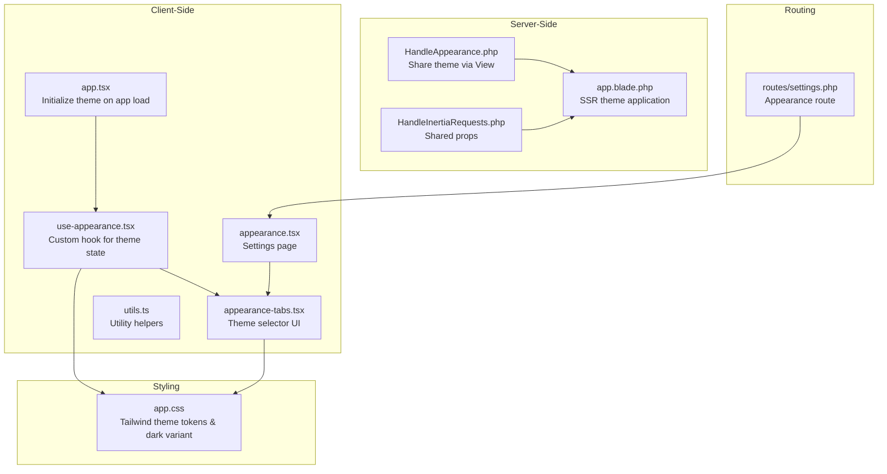
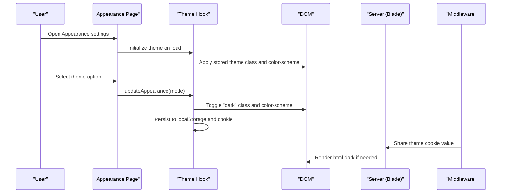
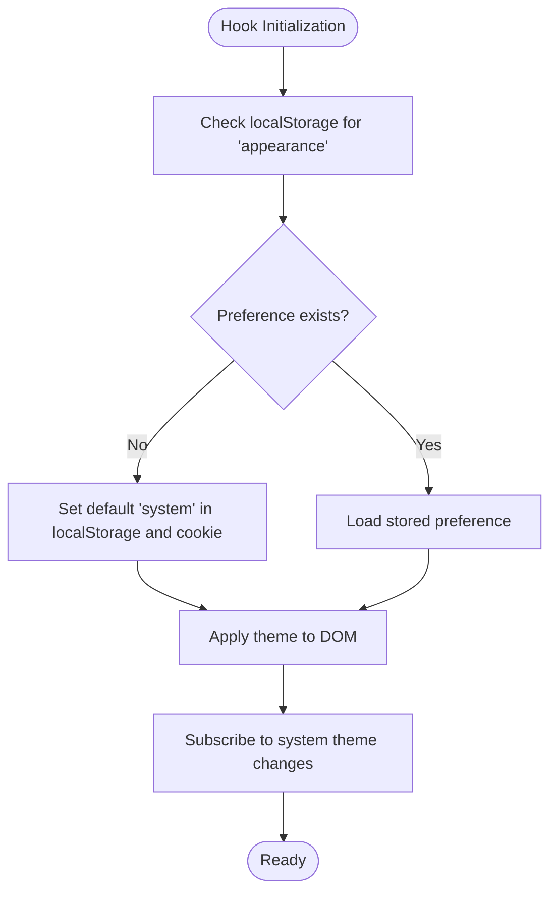
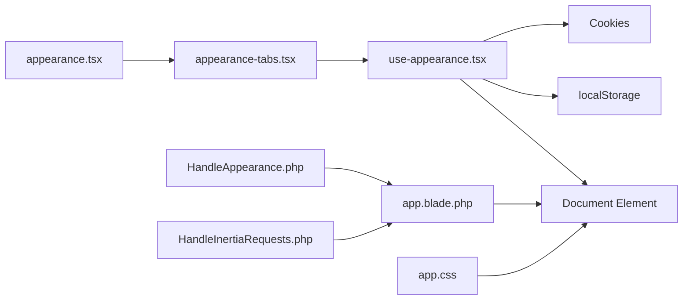

# Appearance Preferences

<cite>
**Referenced Files in This Document**
- [appearance.tsx](file://resources/js/pages/settings/appearance.tsx)
- [appearance-tabs.tsx](file://resources/js/components/appearance-tabs.tsx)
- [use-appearance.tsx](file://resources/js/hooks/use-appearance.tsx)
- [app.tsx](file://resources/js/app.tsx)
- [app.css](file://resources/css/app.css)
- [app.blade.php](file://resources/views/app.blade.php)
- [HandleAppearance.php](file://app/Http/Middleware/HandleAppearance.php)
- [HandleInertiaRequests.php](file://app/Http/Middleware/HandleInertiaRequests.php)
- [settings.php](file://routes/settings.php)
- [utils.ts](file://resources/js/lib/utils.ts)
</cite>

## Table of Contents
1. [Introduction](#introduction)
2. [Project Structure](#project-structure)
3. [Core Components](#core-components)
4. [Architecture Overview](#architecture-overview)
5. [Detailed Component Analysis](#detailed-component-analysis)
6. [Dependency Analysis](#dependency-analysis)
7. [Performance Considerations](#performance-considerations)
8. [Troubleshooting Guide](#troubleshooting-guide)
9. [Conclusion](#conclusion)

## Introduction
This document describes the appearance and theme customization system in the application. It covers the appearance settings page, theme selection controls, client-side and server-side theme handling, persistence mechanisms, and integration with the overall theming system. The system supports three modes—light, dark, and system—with automatic detection of system preferences and immediate real-time switching.

## Project Structure
The appearance system spans frontend React components, a custom hook for state management, Tailwind CSS theme tokens, and server-side middleware for initial SSR theme resolution.

**Diagram sources**
- [app.tsx:39-41](file://resources/js/app.tsx#L39-L41)
- [use-appearance.tsx:90-115](file://resources/js/hooks/use-appearance.tsx#L90-L115)
- [appearance-tabs.tsx:1-46](file://resources/js/components/appearance-tabs.tsx#L1-L46)
- [appearance.tsx:1-33](file://resources/js/pages/settings/appearance.tsx#L1-L33)
- [HandleAppearance.php:17-22](file://app/Http/Middleware/HandleAppearance.php#L17-L22)
- [HandleInertiaRequests.php:36-46](file://app/Http/Middleware/HandleInertiaRequests.php#L36-L46)
- [app.blade.php:1-49](file://resources/views/app.blade.php#L1-L49)
- [app.css:8-133](file://resources/css/app.css#L8-L133)
- [settings.php:26](file://routes/settings.php#L26)

**Section sources**
- [appearance.tsx:1-33](file://resources/js/pages/settings/appearance.tsx#L1-L33)
- [appearance-tabs.tsx:1-46](file://resources/js/components/appearance-tabs.tsx#L1-L46)
- [use-appearance.tsx:1-116](file://resources/js/hooks/use-appearance.tsx#L1-L116)
- [app.tsx:1-41](file://resources/js/app.tsx#L1-L41)
- [app.css:1-144](file://resources/css/app.css#L1-L144)
- [app.blade.php:1-49](file://resources/views/app.blade.php#L1-L49)
- [HandleAppearance.php:1-24](file://app/Http/Middleware/HandleAppearance.php#L1-L24)
- [HandleInertiaRequests.php:1-48](file://app/Http/Middleware/HandleInertiaRequests.php#L1-L48)
- [settings.php:1-35](file://routes/settings.php#L1-L35)

## Core Components
- Appearance Settings Page: Renders the page header and the theme selector tab component.
- Theme Selector Tabs: Provides three options (light, dark, system) with visual feedback and updates the theme.
- Theme Hook: Centralizes theme state, persistence, and DOM application logic.
- SSR Middleware: Shares the stored theme with the Blade template for initial server-side rendering.
- Tailwind Theme Tokens: Defines CSS variables and dark variant classes for consistent theming.

Key responsibilities:
- Persist theme preference in both localStorage and cookies.
- Apply theme to the document element and color-scheme meta.
- React to system theme changes and update accordingly.
- Support immediate real-time switching without page reload.

**Section sources**
- [appearance.tsx:6-23](file://resources/js/pages/settings/appearance.tsx#L6-L23)
- [appearance-tabs.tsx:8-45](file://resources/js/components/appearance-tabs.tsx#L8-L45)
- [use-appearance.tsx:73-115](file://resources/js/hooks/use-appearance.tsx#L73-L115)
- [HandleAppearance.php:17-22](file://app/Http/Middleware/HandleAppearance.php#L17-L22)
- [app.css:8-133](file://resources/css/app.css#L8-L133)

## Architecture Overview
The appearance system integrates client-side and server-side concerns:

- Client initialization applies the stored theme and subscribes to system theme changes.
- The theme selector updates state, persists to localStorage and cookies, and applies the theme.
- On the server, middleware shares the theme cookie so the Blade template renders the correct dark class initially.
- Tailwind CSS variables and the dark variant ensure consistent styling across components.

**Diagram sources**
- [app.tsx:39-41](file://resources/js/app.tsx#L39-L41)
- [use-appearance.tsx:73-115](file://resources/js/hooks/use-appearance.tsx#L73-L115)
- [appearance-tabs.tsx:28-42](file://resources/js/components/appearance-tabs.tsx#L28-L42)
- [HandleAppearance.php:17-22](file://app/Http/Middleware/HandleAppearance.php#L17-L22)
- [app.blade.php:1-49](file://resources/views/app.blade.php#L1-L49)

## Detailed Component Analysis

### Appearance Settings Page
- Purpose: Hosts the appearance settings UI and sets page metadata.
- Behavior: Uses the settings layout and defines breadcrumbs pointing to the appearance route.
- Integration: Renders the theme selector tabs component.

**Section sources**
- [appearance.tsx:6-33](file://resources/js/pages/settings/appearance.tsx#L6-L33)
- [settings.php:26](file://routes/settings.php#L26)

### Theme Selector Tabs Component
- Purpose: Provides a tabbed interface to choose between light, dark, and system themes.
- Behavior: Reads current theme from the hook and invokes update callbacks on selection.
- Styling: Uses Tailwind utility classes with dark variants for visual consistency.

**Section sources**
- [appearance-tabs.tsx:8-45](file://resources/js/components/appearance-tabs.tsx#L8-L45)
- [utils.ts:6-13](file://resources/js/lib/utils.ts#L6-L13)

### Theme Hook (use-appearance)
- State model:
  - Appearance: union of 'light', 'dark', 'system'.
  - ResolvedAppearance: derived 'light' or 'dark' based on current mode and system preference.
- Persistence:
  - localStorage: client-side persistence for immediate UX.
  - Cookie: SSR persistence for initial server render alignment.
- Application:
  - Adds/removes 'dark' class on documentElement.
  - Sets color-scheme to match the resolved theme.
- Subscription:
  - Notifies subscribers when theme changes for reactive UI updates.
- Initialization:
  - Ensures a default 'system' preference exists.
  - Subscribes to system theme media query changes.

**Diagram sources**
- [use-appearance.tsx:73-88](file://resources/js/hooks/use-appearance.tsx#L73-L88)

**Section sources**
- [use-appearance.tsx:1-116](file://resources/js/hooks/use-appearance.tsx#L1-L116)

### Server-Side Theme Resolution (HandleAppearance Middleware)
- Purpose: Share the theme cookie value with Blade templates via View data.
- Behavior: Reads the 'appearance' cookie and defaults to 'system' if absent.
- Integration: Used by the Blade layout to conditionally apply the 'dark' class on the html element.

**Section sources**
- [HandleAppearance.php:17-22](file://app/Http/Middleware/HandleAppearance.php#L17-L22)
- [app.blade.php:1-49](file://resources/views/app.blade.php#L1-L49)

### Tailwind Theme Tokens and Dark Variant
- CSS Variables: Centralized oklch color tokens for light and dark palettes.
- Dark Variant: Tailwind custom variant enables selectors like &:is(.dark *).
- Base Layer: Applies background and foreground tokens to body and base elements.

**Section sources**
- [app.css:8-133](file://resources/css/app.css#L8-L133)

### Client Initialization and Real-Time Switching
- Initialization: Called on app boot to ensure theme is applied before rendering.
- Real-time switching: Updates DOM immediately and persists both client-side and server-side.

**Section sources**
- [app.tsx:39-41](file://resources/js/app.tsx#L39-L41)
- [use-appearance.tsx:101-112](file://resources/js/hooks/use-appearance.tsx#L101-L112)

## Dependency Analysis
The appearance system exhibits low coupling and clear separation of concerns:

- Client hook depends on DOM APIs, localStorage, and cookies.
- UI component depends on the hook and utility classes.
- Server middleware depends on request cookies and View sharing.
- Styling depends on Tailwind configuration and CSS variables.

**Diagram sources**
- [use-appearance.tsx:23-30](file://resources/js/hooks/use-appearance.tsx#L23-L30)
- [appearance-tabs.tsx:12](file://resources/js/components/appearance-tabs.tsx#L12)
- [HandleAppearance.php:19](file://app/Http/Middleware/HandleAppearance.php#L19)
- [app.blade.php:2](file://resources/views/app.blade.php#L2)
- [app.css:8](file://resources/css/app.css#L8)
- [HandleInertiaRequests.php:44](file://app/Http/Middleware/HandleInertiaRequests.php#L44)

**Section sources**
- [use-appearance.tsx:1-116](file://resources/js/hooks/use-appearance.tsx#L1-L116)
- [appearance-tabs.tsx:1-46](file://resources/js/components/appearance-tabs.tsx#L1-L46)
- [HandleAppearance.php:1-24](file://app/Http/Middleware/HandleAppearance.php#L1-L24)
- [app.blade.php:1-49](file://resources/views/app.blade.php#L1-L49)
- [app.css:1-144](file://resources/css/app.css#L1-L144)
- [HandleInertiaRequests.php:1-48](file://app/Http/Middleware/HandleInertiaRequests.php#L1-L48)

## Performance Considerations
- Efficient DOM updates: The hook toggles a single class and color-scheme property, minimizing reflows.
- Minimal subscriptions: One media query listener per page lifecycle reduces overhead.
- Local-first persistence: localStorage avoids network requests for theme decisions.
- SSR alignment: Server middleware ensures the initial render matches the user's preference, preventing FOUC.

## Troubleshooting Guide
Common issues and resolutions:
- Initial flicker on load:
  - Cause: Browser default theme vs. user preference.
  - Resolution: Ensure initialization runs early and inline script applies 'dark' class when appropriate.
  - References: [app.tsx:39-41](file://resources/js/app.tsx#L39-L41), [app.blade.php:7-20](file://resources/views/app.blade.php#L7-L20)

- Theme not persisting across sessions:
  - Cause: Missing cookie or localStorage entries.
  - Resolution: Verify initialization writes default 'system' and subsequent updates write to both storage and cookie.
  - References: [use-appearance.tsx:78-81](file://resources/js/hooks/use-appearance.tsx#L78-L81), [use-appearance.tsx:104-108](file://resources/js/hooks/use-appearance.tsx#L104-L108)

- Server and client mismatch:
  - Cause: Server rendering differs from client theme.
  - Resolution: Confirm middleware shares the cookie and Blade template applies the dark class conditionally.
  - References: [HandleAppearance.php:19](file://app/Http/Middleware/HandleAppearance.php#L19), [app.blade.php:2](file://resources/views/app.blade.php#L2)

- System theme changes not reflected:
  - Cause: Media query listener not attached or overridden.
  - Resolution: Ensure initialization attaches the listener and that no other code removes it.
  - References: [use-appearance.tsx:86-87](file://resources/js/hooks/use-appearance.tsx#L86-L87)

- Styling inconsistencies:
  - Cause: Missing dark variant or incorrect CSS variable usage.
  - Resolution: Use the dark variant selector and Tailwind tokens consistently.
  - References: [app.css:8](file://resources/css/app.css#L8), [app.css:100-133](file://resources/css/app.css#L100-L133)

**Section sources**
- [app.tsx:39-41](file://resources/js/app.tsx#L39-L41)
- [app.blade.php:7-20](file://resources/views/app.blade.php#L7-L20)
- [use-appearance.tsx:78-81](file://resources/js/hooks/use-appearance.tsx#L78-L81)
- [use-appearance.tsx:104-108](file://resources/js/hooks/use-appearance.tsx#L104-L108)
- [HandleAppearance.php:19](file://app/Http/Middleware/HandleAppearance.php#L19)
- [app.css:8](file://resources/css/app.css#L8)
- [app.css:100-133](file://resources/css/app.css#L100-L133)
- [use-appearance.tsx:86-87](file://resources/js/hooks/use-appearance.tsx#L86-L87)

## Conclusion
The appearance and theme customization system combines a robust client-side hook, a simple UI component, and server-side middleware to deliver a seamless, persistent, and responsive theming experience. By leveraging localStorage, cookies, and Tailwind CSS variables, it ensures consistent visuals across environments while supporting real-time switching and system preference alignment.