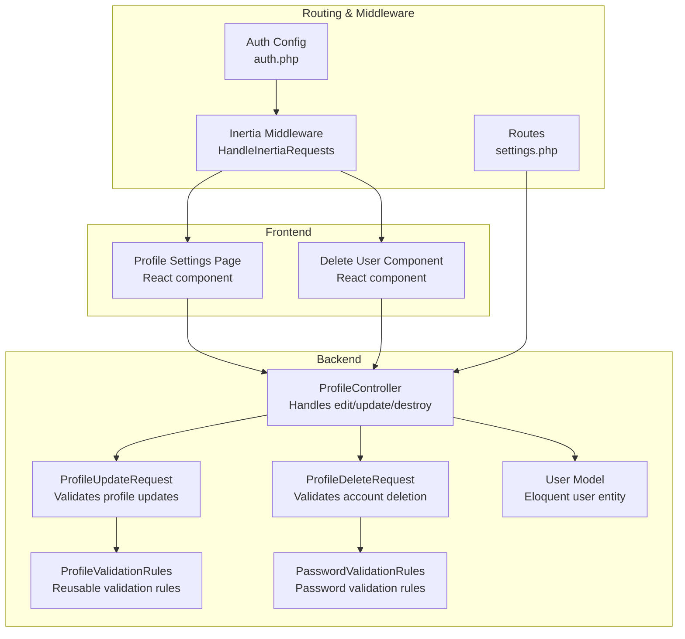
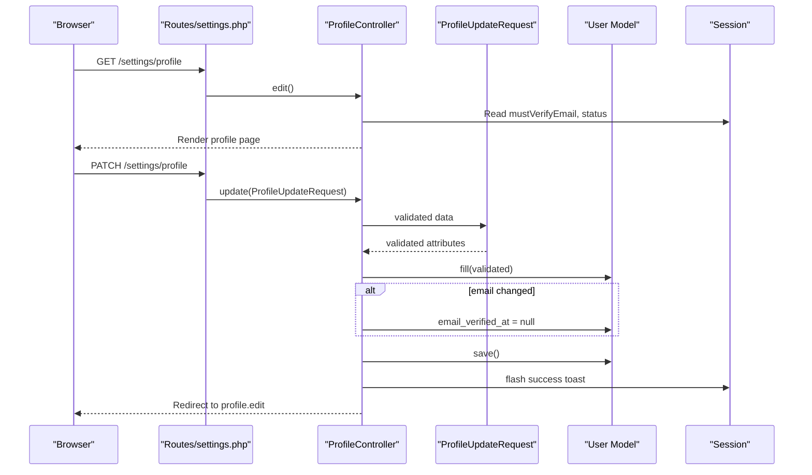
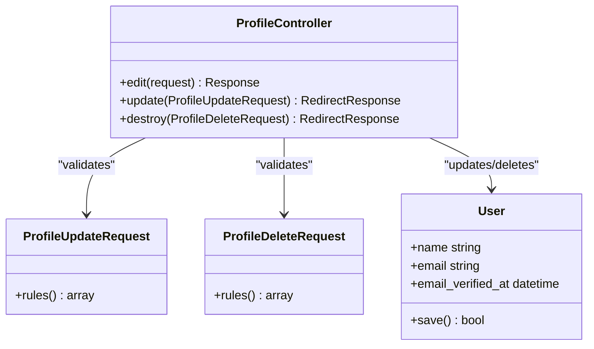
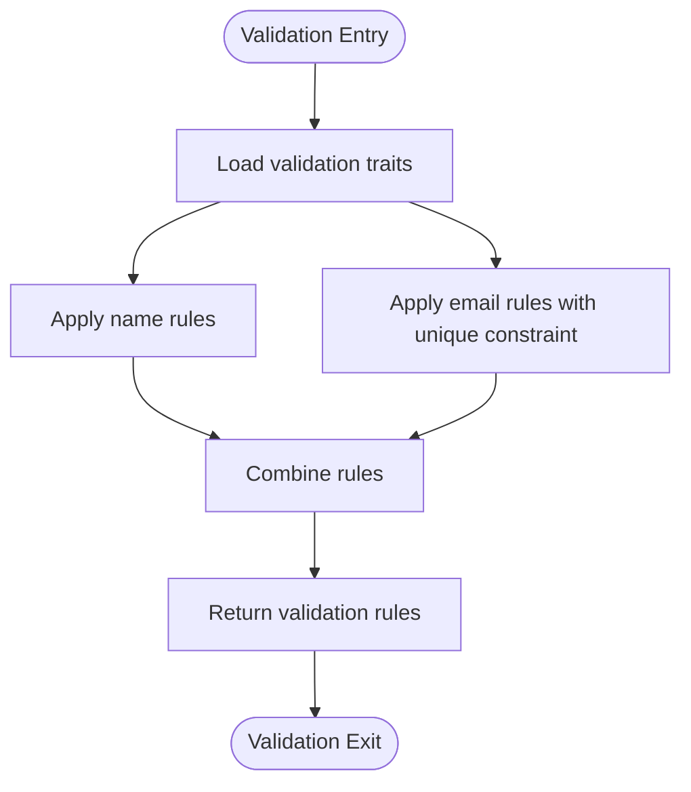
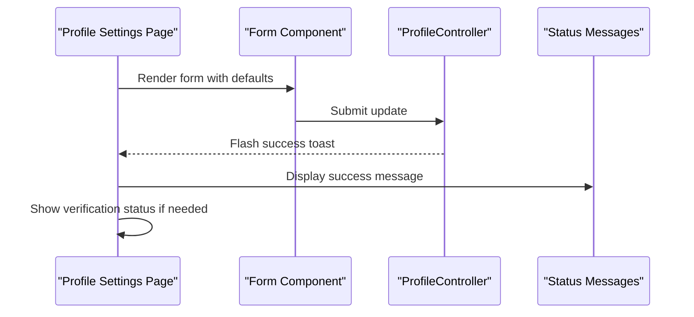
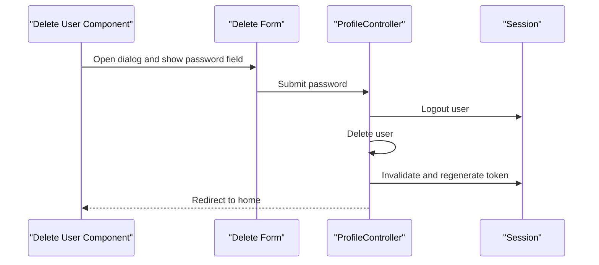
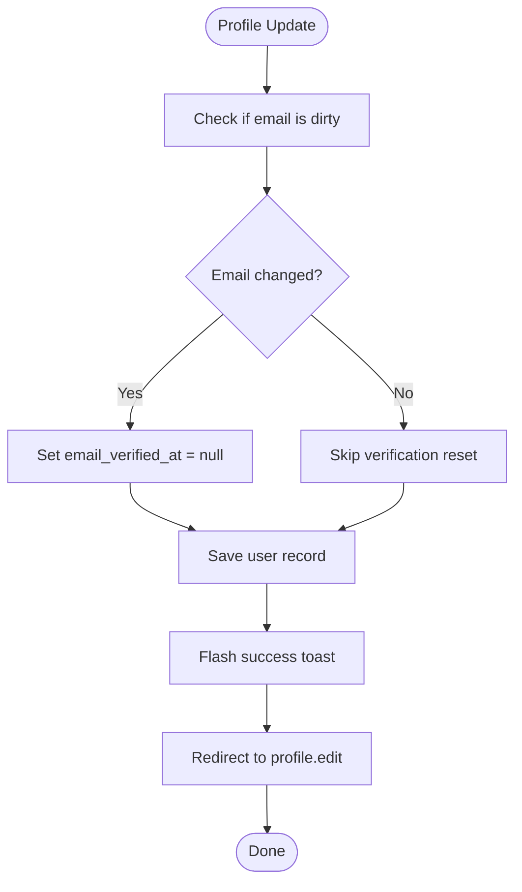
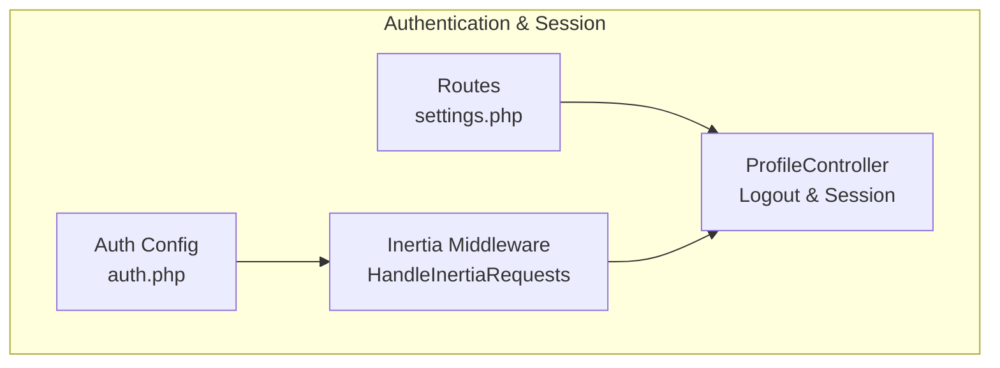
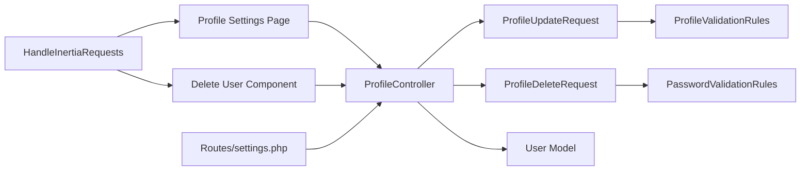

# Profile Management

<cite>
**Referenced Files in This Document**
- [ProfileController.php](file://app/Http/Controllers/Settings/ProfileController.php)
- [ProfileUpdateRequest.php](file://app/Http/Requests/Settings/ProfileUpdateRequest.php)
- [ProfileDeleteRequest.php](file://app/Http/Requests/Settings/ProfileDeleteRequest.php)
- [ProfileValidationRules.php](file://app/Concerns/ProfileValidationRules.php)
- [PasswordValidationRules.php](file://app/Concerns/PasswordValidationRules.php)
- [profile.tsx](file://resources/js/pages/settings/profile.tsx)
- [delete-user.tsx](file://resources/js/components/delete-user.tsx)
- [settings.php](file://routes/settings.php)
- [User.php](file://app/Models/User.php)
- [HandleInertiaRequests.php](file://app/Http/Middleware/HandleInertiaRequests.php)
- [auth.php](file://config/auth.php)
- [ProfileUpdateTest.php](file://tests/Feature/Settings/ProfileUpdateTest.php)
</cite>

## Table of Contents
1. [Introduction](#introduction)
2. [Project Structure](#project-structure)
3. [Core Components](#core-components)
4. [Architecture Overview](#architecture-overview)
5. [Detailed Component Analysis](#detailed-component-analysis)
6. [Dependency Analysis](#dependency-analysis)
7. [Performance Considerations](#performance-considerations)
8. [Troubleshooting Guide](#troubleshooting-guide)
9. [Conclusion](#conclusion)

## Introduction
This document provides comprehensive documentation for the profile management system, focusing on the ProfileController implementation, validation rules, and frontend integration. It explains profile editing, updates, and deletion functionality, details the ProfileUpdateRequest and ProfileDeleteRequest validation rules and business logic, and describes the profile settings page implementation with form handling, email verification status display, and success messaging. Examples of profile update workflows, email change handling with verification status reset, and user account deletion processes are included, along with integration details for the authentication system and session management during profile changes.

## Project Structure
The profile management system spans backend PHP controllers and requests, frontend React components, routing configuration, and shared data through Inertia middleware. The key components are organized as follows:
- Backend: ProfileController handles GET/POST requests for profile editing and updates, and DELETE requests for account deletion.
- Validation: ProfileUpdateRequest and ProfileDeleteRequest encapsulate validation rules using reusable traits.
- Frontend: The profile settings page renders forms, displays email verification status, and integrates with the delete account component.
- Routing: Routes define authenticated access for profile operations and require email verification for destructive actions.
- Shared Data: Inertia middleware shares authenticated user data and application configuration across requests.

**Diagram sources**
- [ProfileController.php:15-62](file://app/Http/Controllers/Settings/ProfileController.php#L15-L62)
- [ProfileUpdateRequest.php:9-22](file://app/Http/Requests/Settings/ProfileUpdateRequest.php#L9-L22)
- [ProfileDeleteRequest.php:9-24](file://app/Http/Requests/Settings/ProfileDeleteRequest.php#L9-L24)
- [ProfileValidationRules.php:9-51](file://app/Concerns/ProfileValidationRules.php#L9-L51)
- [PasswordValidationRules.php:8-29](file://app/Concerns/PasswordValidationRules.php#L8-L29)
- [profile.tsx:18-129](file://resources/js/pages/settings/profile.tsx#L18-L129)
- [delete-user.tsx:19-120](file://resources/js/components/delete-user.tsx#L19-L120)
- [settings.php:8-27](file://routes/settings.php#L8-L27)
- [HandleInertiaRequests.php:8-47](file://app/Http/Middleware/HandleInertiaRequests.php#L8-L47)
- [auth.php:5-117](file://config/auth.php#L5-L117)

**Section sources**
- [ProfileController.php:15-62](file://app/Http/Controllers/Settings/ProfileController.php#L15-L62)
- [ProfileUpdateRequest.php:9-22](file://app/Http/Requests/Settings/ProfileUpdateRequest.php#L9-L22)
- [ProfileDeleteRequest.php:9-24](file://app/Http/Requests/Settings/ProfileDeleteRequest.php#L9-L24)
- [ProfileValidationRules.php:9-51](file://app/Concerns/ProfileValidationRules.php#L9-L51)
- [PasswordValidationRules.php:8-29](file://app/Concerns/PasswordValidationRules.php#L8-L29)
- [profile.tsx:18-129](file://resources/js/pages/settings/profile.tsx#L18-L129)
- [delete-user.tsx:19-120](file://resources/js/components/delete-user.tsx#L19-L120)
- [settings.php:8-27](file://routes/settings.php#L8-L27)
- [HandleInertiaRequests.php:8-47](file://app/Http/Middleware/HandleInertiaRequests.php#L8-L47)
- [auth.php:5-117](file://config/auth.php#L5-L117)

## Core Components
This section documents the primary components involved in profile management, including the controller actions, validation requests, frontend rendering, and routing configuration.

- ProfileController: Implements edit, update, and destroy actions with proper authentication and session handling.
- ProfileUpdateRequest: Applies profile-specific validation rules using shared validation traits.
- ProfileDeleteRequest: Enforces current password verification for account deletion.
- Profile Settings Page: Renders the profile update form, displays email verification status, and shows success messages.
- Delete User Component: Provides a modal interface for confirming account deletion with password validation.
- Routes: Define authenticated access for profile operations and require email verification for destructive actions.
- Inertia Middleware: Shares authenticated user data and application configuration across requests.
- User Model: Defines the Eloquent user entity with email verification and two-factor authentication support.

**Section sources**
- [ProfileController.php:15-62](file://app/Http/Controllers/Settings/ProfileController.php#L15-L62)
- [ProfileUpdateRequest.php:9-22](file://app/Http/Requests/Settings/ProfileUpdateRequest.php#L9-L22)
- [ProfileDeleteRequest.php:9-24](file://app/Http/Requests/Settings/ProfileDeleteRequest.php#L9-L24)
- [profile.tsx:18-129](file://resources/js/pages/settings/profile.tsx#L18-L129)
- [delete-user.tsx:19-120](file://resources/js/components/delete-user.tsx#L19-L120)
- [settings.php:8-27](file://routes/settings.php#L8-L27)
- [HandleInertiaRequests.php:36-46](file://app/Http/Middleware/HandleInertiaRequests.php#L36-L46)
- [User.php:32-49](file://app/Models/User.php#L32-L49)

## Architecture Overview
The profile management system follows a layered architecture:
- Presentation Layer: React components render the profile settings page and delete account interface.
- Application Layer: ProfileController orchestrates business logic for profile updates and deletions.
- Domain Layer: Eloquent User model persists user data and maintains verification state.
- Infrastructure Layer: Inertia middleware shares authenticated user data, while routing enforces authentication and verification policies.

**Diagram sources**
- [settings.php:8-13](file://routes/settings.php#L8-L13)
- [ProfileController.php:20-44](file://app/Http/Controllers/Settings/ProfileController.php#L20-L44)
- [ProfileUpdateRequest.php:9-22](file://app/Http/Requests/Settings/ProfileUpdateRequest.php#L9-L22)
- [User.php:32-49](file://app/Models/User.php#L32-L49)

## Detailed Component Analysis

### ProfileController Implementation
The ProfileController manages profile-related operations:
- edit(): Renders the profile settings page and passes email verification flags and status messages to the frontend.
- update(): Validates incoming profile data, resets email verification when the email changes, saves the user record, flashes a success message, and redirects back to the profile edit page.
- destroy(): Logs out the user, deletes the user record, invalidates the session, regenerates the CSRF token, and redirects to the home page.

**Diagram sources**
- [ProfileController.php:15-62](file://app/Http/Controllers/Settings/ProfileController.php#L15-L62)
- [ProfileUpdateRequest.php:9-22](file://app/Http/Requests/Settings/ProfileUpdateRequest.php#L9-L22)
- [ProfileDeleteRequest.php:9-24](file://app/Http/Requests/Settings/ProfileDeleteRequest.php#L9-L24)
- [User.php:32-49](file://app/Models/User.php#L32-L49)

**Section sources**
- [ProfileController.php:15-62](file://app/Http/Controllers/Settings/ProfileController.php#L15-L62)

### Validation Rules and Business Logic
ProfileUpdateRequest and ProfileDeleteRequest encapsulate validation logic:
- ProfileUpdateRequest: Uses ProfileValidationRules to enforce name and email constraints, ensuring uniqueness per user ID.
- ProfileDeleteRequest: Uses PasswordValidationRules to require the current password for account deletion.

**Diagram sources**
- [ProfileUpdateRequest.php:9-22](file://app/Http/Requests/Settings/ProfileUpdateRequest.php#L9-L22)
- [ProfileValidationRules.php:16-50](file://app/Concerns/ProfileValidationRules.php#L16-L50)

**Section sources**
- [ProfileUpdateRequest.php:9-22](file://app/Http/Requests/Settings/ProfileUpdateRequest.php#L9-L22)
- [ProfileDeleteRequest.php:9-24](file://app/Http/Requests/Settings/ProfileDeleteRequest.php#L9-L24)
- [ProfileValidationRules.php:16-50](file://app/Concerns/ProfileValidationRules.php#L16-L50)
- [PasswordValidationRules.php:25-28](file://app/Concerns/PasswordValidationRules.php#L25-L28)

### Profile Settings Page Implementation
The profile settings page renders:
- A form for updating name and email with default values populated from the authenticated user.
- Conditional display of email verification status and resend verification link when applicable.
- Success messaging when a verification link is resent.
- Integration with the delete account component for secure account termination.

**Diagram sources**
- [profile.tsx:18-129](file://resources/js/pages/settings/profile.tsx#L18-L129)

**Section sources**
- [profile.tsx:18-129](file://resources/js/pages/settings/profile.tsx#L18-L129)

### Account Deletion Workflow
The delete account component provides:
- A confirmation dialog with password input.
- Validation of the current password before proceeding.
- Secure deletion after successful validation, including session cleanup and redirection.

**Diagram sources**
- [delete-user.tsx:19-120](file://resources/js/components/delete-user.tsx#L19-L120)
- [ProfileController.php:49-61](file://app/Http/Controllers/Settings/ProfileController.php#L49-L61)

**Section sources**
- [delete-user.tsx:19-120](file://resources/js/components/delete-user.tsx#L19-L120)
- [ProfileController.php:49-61](file://app/Http/Controllers/Settings/ProfileController.php#L49-L61)

### Email Change Handling and Verification Status Reset
When a user updates their email address:
- The controller detects changes to the email field.
- The email verification timestamp is cleared to require re-verification.
- The frontend conditionally displays verification prompts and success messages.

**Diagram sources**
- [ProfileController.php:31-44](file://app/Http/Controllers/Settings/ProfileController.php#L31-L44)

**Section sources**
- [ProfileController.php:31-44](file://app/Http/Controllers/Settings/ProfileController.php#L31-L44)

### Integration with Authentication System and Session Management
Authentication and session management during profile changes:
- Routes enforce authentication for profile operations and require email verification for destructive actions.
- Inertia middleware shares authenticated user data and application configuration.
- ProfileController performs logout, session invalidation, and CSRF token regeneration during account deletion.

**Diagram sources**
- [settings.php:8-27](file://routes/settings.php#L8-L27)
- [HandleInertiaRequests.php:36-46](file://app/Http/Middleware/HandleInertiaRequests.php#L36-L46)
- [auth.php:40-45](file://config/auth.php#L40-L45)
- [ProfileController.php:53-58](file://app/Http/Controllers/Settings/ProfileController.php#L53-L58)

**Section sources**
- [settings.php:8-27](file://routes/settings.php#L8-L27)
- [HandleInertiaRequests.php:36-46](file://app/Http/Middleware/HandleInertiaRequests.php#L36-L46)
- [auth.php:40-45](file://config/auth.php#L40-L45)
- [ProfileController.php:53-58](file://app/Http/Controllers/Settings/ProfileController.php#L53-L58)

## Dependency Analysis
The profile management system exhibits clear separation of concerns:
- Controller depends on validation requests and the User model.
- Validation requests rely on reusable traits for consistent rules.
- Frontend components depend on the controller action signatures and route names.
- Routing enforces middleware policies for authentication and verification.
- Middleware ensures shared data availability across requests.

**Diagram sources**
- [profile.tsx:18-129](file://resources/js/pages/settings/profile.tsx#L18-L129)
- [delete-user.tsx:19-120](file://resources/js/components/delete-user.tsx#L19-L120)
- [ProfileController.php:15-62](file://app/Http/Controllers/Settings/ProfileController.php#L15-L62)
- [ProfileUpdateRequest.php:9-22](file://app/Http/Requests/Settings/ProfileUpdateRequest.php#L9-L22)
- [ProfileDeleteRequest.php:9-24](file://app/Http/Requests/Settings/ProfileDeleteRequest.php#L9-L24)
- [ProfileValidationRules.php:9-51](file://app/Concerns/ProfileValidationRules.php#L9-L51)
- [PasswordValidationRules.php:8-29](file://app/Concerns/PasswordValidationRules.php#L8-L29)
- [User.php:32-49](file://app/Models/User.php#L32-L49)
- [settings.php:8-27](file://routes/settings.php#L8-L27)
- [HandleInertiaRequests.php:36-46](file://app/Http/Middleware/HandleInertiaRequests.php#L36-L46)

**Section sources**
- [ProfileController.php:15-62](file://app/Http/Controllers/Settings/ProfileController.php#L15-L62)
- [ProfileUpdateRequest.php:9-22](file://app/Http/Requests/Settings/ProfileUpdateRequest.php#L9-L22)
- [ProfileDeleteRequest.php:9-24](file://app/Http/Requests/Settings/ProfileDeleteRequest.php#L9-L24)
- [ProfileValidationRules.php:9-51](file://app/Concerns/ProfileValidationRules.php#L9-L51)
- [PasswordValidationRules.php:8-29](file://app/Concerns/PasswordValidationRules.php#L8-L29)
- [User.php:32-49](file://app/Models/User.php#L32-L49)
- [settings.php:8-27](file://routes/settings.php#L8-L27)
- [HandleInertiaRequests.php:36-46](file://app/Http/Middleware/HandleInertiaRequests.php#L36-L46)

## Performance Considerations
- Minimize unnecessary database writes by checking for dirty attributes before saving.
- Use unique validation rules efficiently to avoid redundant queries.
- Keep frontend form submissions lightweight and leverage Inertia's optimistic updates where appropriate.
- Ensure session invalidation and token regeneration occur promptly during destructive operations to prevent session fixation vulnerabilities.

## Troubleshooting Guide
Common issues and resolutions:
- Profile update fails validation: Verify that name and email meet the defined constraints and that the email is unique per user ID.
- Email verification not resetting: Confirm that the email field is being modified and that the controller clears the verification timestamp accordingly.
- Account deletion requires current password: Ensure the password matches the user's current credentials before deletion.
- Session persistence after deletion: Confirm that logout, session invalidation, and token regeneration are executed in the controller.

**Section sources**
- [ProfileUpdateTest.php:15-85](file://tests/Feature/Settings/ProfileUpdateTest.php#L15-L85)
- [ProfileController.php:31-61](file://app/Http/Controllers/Settings/ProfileController.php#L31-L61)

## Conclusion
The profile management system provides a secure, user-friendly interface for managing personal information, with robust validation, clear feedback mechanisms, and strong integration with the authentication and session management layers. The modular design ensures maintainability and extensibility, while the frontend components deliver a responsive user experience.