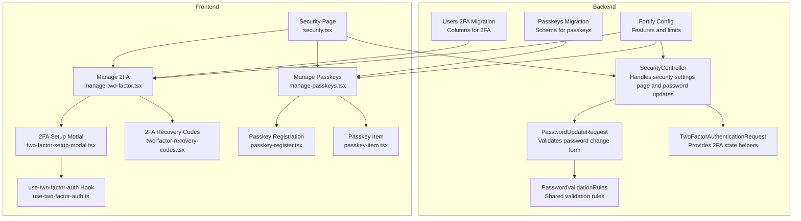
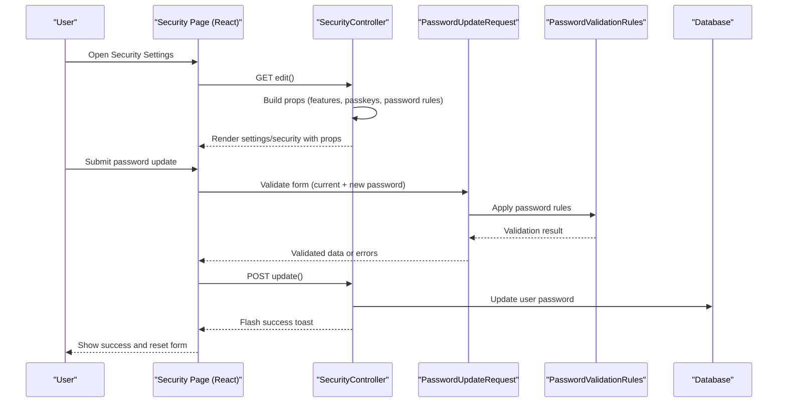
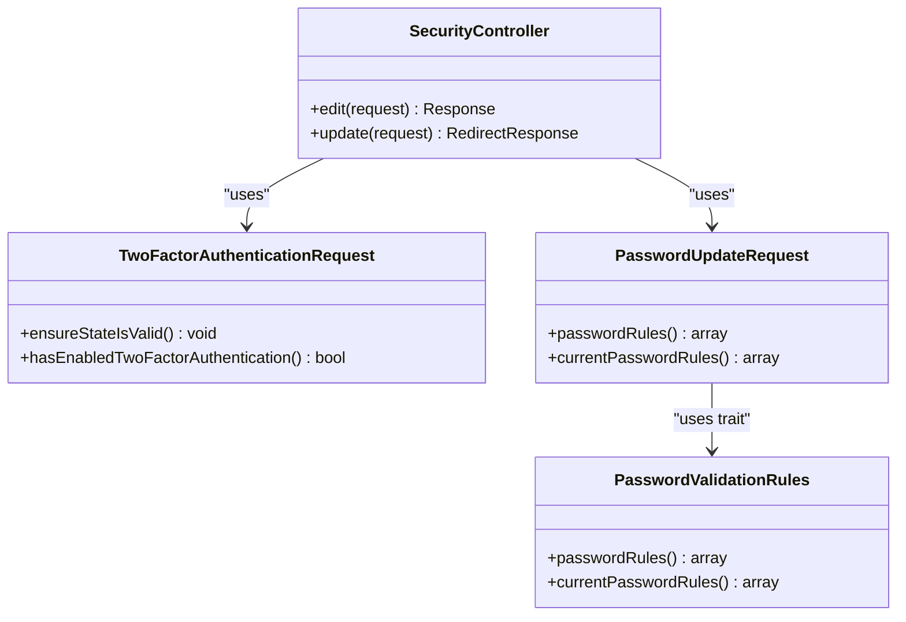
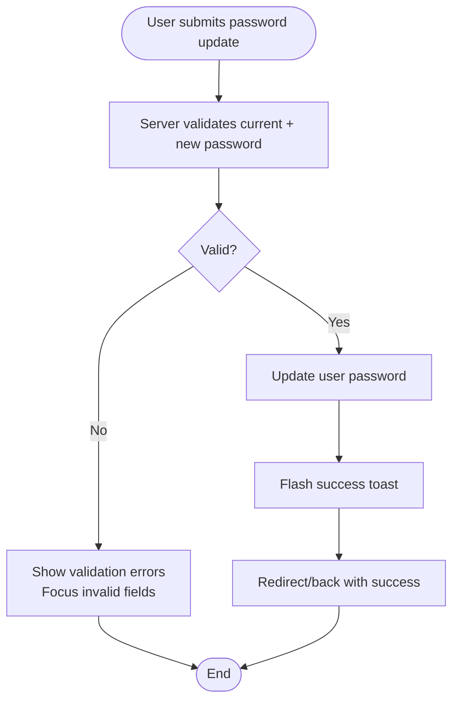
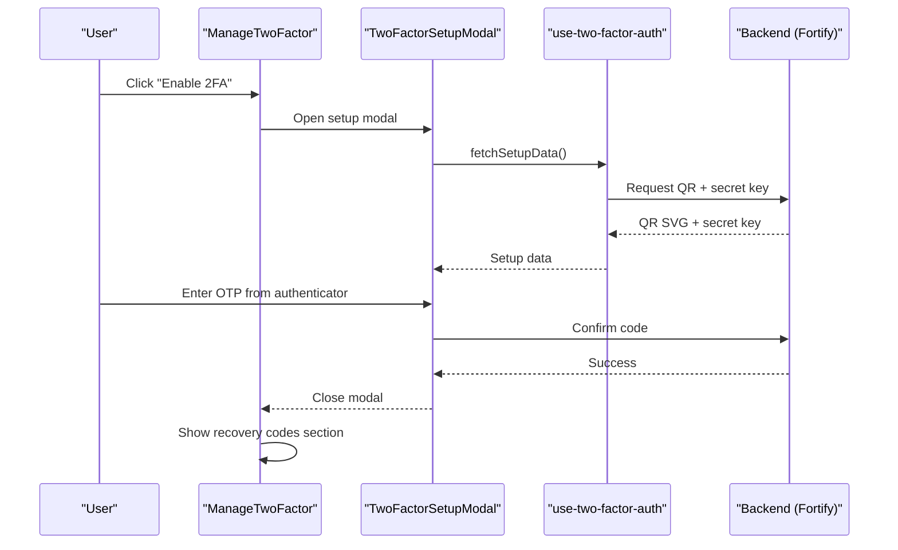
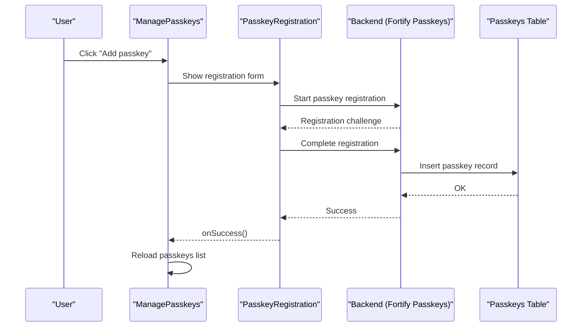
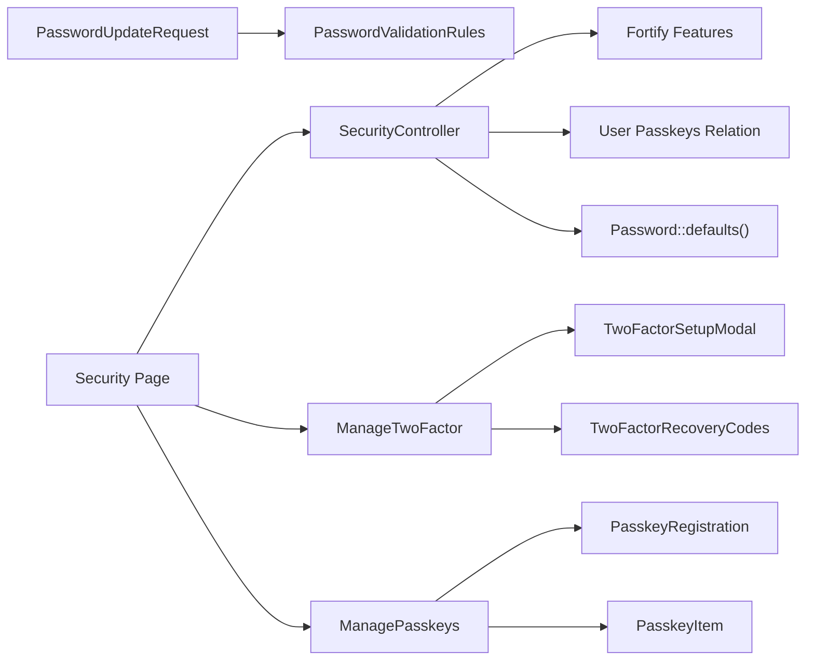

# Security Settings

<cite>
**Referenced Files in This Document**
- [SecurityController.php](file://app/Http/Controllers/Settings/SecurityController.php)
- [PasswordUpdateRequest.php](file://app/Http/Requests/Settings/PasswordUpdateRequest.php)
- [TwoFactorAuthenticationRequest.php](file://app/Http/Requests/Settings/TwoFactorAuthenticationRequest.php)
- [PasswordValidationRules.php](file://app/Concerns/PasswordValidationRules.php)
- [security.tsx](file://resources/js/pages/settings/security.tsx)
- [manage-two-factor.tsx](file://resources/js/components/manage-two-factor.tsx)
- [manage-passkeys.tsx](file://resources/js/components/manage-passkeys.tsx)
- [passkey-register.tsx](file://resources/js/components/passkey-register.tsx)
- [passkey-item.tsx](file://resources/js/components/passkey-item.tsx)
- [two-factor-setup-modal.tsx](file://resources/js/components/two-factor-setup-modal.tsx)
- [two-factor-recovery-codes.tsx](file://resources/js/components/two-factor-recovery-codes.tsx)
- [use-two-factor-auth.ts](file://resources/js/hooks/use-two-factor-auth.ts)
- [fortify.php](file://config/fortify.php)
- [2024_01_01_000000_create_passkeys_table.php](file://database/migrations/2024_01_01_000000_create_passkeys_table.php)
- [2025_08_14_170933_add_two_factor_columns_to_users_table.php](file://database/migrations/2025_08_14_170933_add_two_factor_columns_to_users_table.php)
</cite>

## Table of Contents
1. [Introduction](#introduction)
2. [Project Structure](#project-structure)
3. [Core Components](#core-components)
4. [Architecture Overview](#architecture-overview)
5. [Detailed Component Analysis](#detailed-component-analysis)
6. [Dependency Analysis](#dependency-analysis)
7. [Performance Considerations](#performance-considerations)
8. [Troubleshooting Guide](#troubleshooting-guide)
9. [Conclusion](#conclusion)

## Introduction
This document describes the security settings system, focusing on password updates, two-factor authentication (2FA) management, and passkey administration. It explains the controller implementation, validation rules, frontend components, and backend configuration that together provide a secure and user-friendly security settings experience. It also covers workflows, best practices, and troubleshooting guidance.

## Project Structure
The security settings system spans backend controllers and requests, frontend pages and components, and configuration that enables Fortify features such as 2FA and passkeys. The following diagram shows how the main pieces fit together.

**Diagram sources**
- [SecurityController.php:14-66](file://app/Http/Controllers/Settings/SecurityController.php#L14-L66)
- [PasswordUpdateRequest.php:9-25](file://app/Http/Requests/Settings/PasswordUpdateRequest.php#L9-L25)
- [TwoFactorAuthenticationRequest.php:9-22](file://app/Http/Requests/Settings/TwoFactorAuthenticationRequest.php#L9-L22)
- [PasswordValidationRules.php:8-29](file://app/Concerns/PasswordValidationRules.php#L8-L29)
- [security.tsx:20-138](file://resources/js/pages/settings/security.tsx#L20-L138)
- [manage-two-factor.tsx:17-126](file://resources/js/components/manage-two-factor.tsx#L17-L126)
- [two-factor-setup-modal.tsx:244-351](file://resources/js/components/two-factor-setup-modal.tsx#L244-L351)
- [two-factor-recovery-codes.tsx:21-164](file://resources/js/components/two-factor-recovery-codes.tsx#L21-L164)
- [manage-passkeys.tsx:28-71](file://resources/js/components/manage-passkeys.tsx#L28-L71)
- [passkey-register.tsx:12-108](file://resources/js/components/passkey-register.tsx#L12-L108)
- [passkey-item.tsx:20-93](file://resources/js/components/passkey-item.tsx#L20-L93)
- [use-two-factor-auth.ts:22-111](file://resources/js/hooks/use-two-factor-auth.ts#L22-L111)
- [fortify.php:163-175](file://config/fortify.php#L163-L175)
- [2024_01_01_000000_create_passkeys_table.php:14-24](file://database/migrations/2024_01_01_000000_create_passkeys_table.php#L14-L24)
- [2025_08_14_170933_add_two_factor_columns_to_users_table.php:14-18](file://database/migrations/2025_08_14_170933_add_two_factor_columns_to_users_table.php#L14-L18)

**Section sources**
- [SecurityController.php:14-66](file://app/Http/Controllers/Settings/SecurityController.php#L14-L66)
- [security.tsx:20-138](file://resources/js/pages/settings/security.tsx#L20-L138)
- [fortify.php:163-175](file://config/fortify.php#L163-L175)

## Core Components
- SecurityController: Renders the security settings page and handles password updates. It prepares feature flags, passkey listings, and password policy strings for the frontend.
- PasswordUpdateRequest: Validates current and new passwords using shared validation rules.
- TwoFactorAuthenticationRequest: Provides 2FA state helpers and ensures state validity for the security page.
- PasswordValidationRules: Supplies reusable validation rules for current and new passwords.
- Frontend Security Page: Composes password update form, 2FA management, and passkey management UI.
- 2FA Components: Setup modal, recovery codes viewer/regenerator, and hook for fetching QR and keys.
- Passkey Components: Registration flow, passkey list, and item with removal confirmation.

**Section sources**
- [SecurityController.php:19-65](file://app/Http/Controllers/Settings/SecurityController.php#L19-L65)
- [PasswordUpdateRequest.php:18-24](file://app/Http/Requests/Settings/PasswordUpdateRequest.php#L18-L24)
- [PasswordValidationRules.php:15-28](file://app/Concerns/PasswordValidationRules.php#L15-L28)
- [security.tsx:20-138](file://resources/js/pages/settings/security.tsx#L20-L138)
- [manage-two-factor.tsx:17-126](file://resources/js/components/manage-two-factor.tsx#L17-L126)
- [manage-passkeys.tsx:28-71](file://resources/js/components/manage-passkeys.tsx#L28-L71)

## Architecture Overview
The security settings page is rendered server-side via Inertia, passing feature flags and data to the frontend. The frontend composes modular components for password updates, 2FA setup and management, and passkey registration/removal. Backend validation enforces strong password policies and current password verification. Fortify configuration controls feature availability and security limits.

**Diagram sources**
- [SecurityController.php:19-65](file://app/Http/Controllers/Settings/SecurityController.php#L19-L65)
- [PasswordUpdateRequest.php:18-24](file://app/Http/Requests/Settings/PasswordUpdateRequest.php#L18-L24)
- [PasswordValidationRules.php:15-28](file://app/Concerns/PasswordValidationRules.php#L15-L28)
- [security.tsx:37-123](file://resources/js/pages/settings/security.tsx#L37-L123)

## Detailed Component Analysis

### SecurityController
Responsibilities:
- Renders the security settings page with feature flags and data.
- Handles password updates with validation and feedback.
- Prepares passkey list and password policy string for the UI.

Key behaviors:
- Reads Fortify feature flags for 2FA and passkeys.
- Loads passkeys with selected fields and computed human-readable timestamps.
- Builds a password policy string for client-side validation hints.
- Ensures 2FA state is valid when rendering.
- Updates the password and flashes a success toast.

**Diagram sources**
- [SecurityController.php:14-66](file://app/Http/Controllers/Settings/SecurityController.php#L14-L66)
- [TwoFactorAuthenticationRequest.php:9-22](file://app/Http/Requests/Settings/TwoFactorAuthenticationRequest.php#L9-L22)
- [PasswordUpdateRequest.php:9-25](file://app/Http/Requests/Settings/PasswordUpdateRequest.php#L9-L25)
- [PasswordValidationRules.php:8-29](file://app/Concerns/PasswordValidationRules.php#L8-L29)

**Section sources**
- [SecurityController.php:19-65](file://app/Http/Controllers/Settings/SecurityController.php#L19-L65)

### Password Update Workflow
Validation rules:
- New password must satisfy Laravel's default password rules and confirmation.
- Current password must match the user's existing password.

Frontend integration:
- PasswordInput components receive the password policy string for real-time hints.
- Form resets on success and focuses on appropriate fields on error.

**Diagram sources**
- [PasswordUpdateRequest.php:18-24](file://app/Http/Requests/Settings/PasswordUpdateRequest.php#L18-L24)
- [PasswordValidationRules.php:15-28](file://app/Concerns/PasswordValidationRules.php#L15-L28)
- [security.tsx:37-123](file://resources/js/pages/settings/security.tsx#L37-L123)
- [SecurityController.php:56-65](file://app/Http/Controllers/Settings/SecurityController.php#L56-L65)

**Section sources**
- [PasswordUpdateRequest.php:18-24](file://app/Http/Requests/Settings/PasswordUpdateRequest.php#L18-L24)
- [PasswordValidationRules.php:15-28](file://app/Concerns/PasswordValidationRules.php#L15-L28)
- [security.tsx:37-123](file://resources/js/pages/settings/security.tsx#L37-L123)
- [SecurityController.php:56-65](file://app/Http/Controllers/Settings/SecurityController.php#L56-L65)

### Two-Factor Authentication Management
Feature flags:
- Controlled by Fortify configuration; supports enabling/disabling and requiring confirmation.

Components:
- ManageTwoFactor: Shows enable/disable actions, triggers setup modal, and displays recovery codes.
- TwoFactorSetupModal: Guides through QR scanning/manual key entry and OTP verification.
- TwoFactorRecoveryCodes: Allows viewing and regenerating recovery codes.
- use-two-factor-auth: Fetches QR SVG, manual setup key, and recovery codes; manages state and errors.

**Diagram sources**
- [manage-two-factor.tsx:17-126](file://resources/js/components/manage-two-factor.tsx#L17-L126)
- [two-factor-setup-modal.tsx:244-351](file://resources/js/components/two-factor-setup-modal.tsx#L244-L351)
- [two-factor-recovery-codes.tsx:21-164](file://resources/js/components/two-factor-recovery-codes.tsx#L21-L164)
- [use-two-factor-auth.ts:22-111](file://resources/js/hooks/use-two-factor-auth.ts#L22-L111)
- [fortify.php:167-174](file://config/fortify.php#L167-L174)

**Section sources**
- [manage-two-factor.tsx:17-126](file://resources/js/components/manage-two-factor.tsx#L17-L126)
- [two-factor-setup-modal.tsx:244-351](file://resources/js/components/two-factor-setup-modal.tsx#L244-L351)
- [two-factor-recovery-codes.tsx:21-164](file://resources/js/components/two-factor-recovery-codes.tsx#L21-L164)
- [use-two-factor-auth.ts:22-111](file://resources/js/hooks/use-two-factor-auth.ts#L22-L111)
- [fortify.php:167-174](file://config/fortify.php#L167-L174)

### Passkey Administration
Components:
- ManagePasskeys: Lists registered passkeys and renders registration form.
- PasskeyRegistration: Handles passkey creation via WebAuthn with user agent/device hints.
- PasskeyItem: Displays passkey metadata and removal confirmation dialog.

Backend schema:
- Passkeys table stores credential identifiers, JSON credential data, and timestamps.

**Diagram sources**
- [manage-passkeys.tsx:28-71](file://resources/js/components/manage-passkeys.tsx#L28-L71)
- [passkey-register.tsx:12-108](file://resources/js/components/passkey-register.tsx#L12-L108)
- [2024_01_01_000000_create_passkeys_table.php:14-24](file://database/migrations/2024_01_01_000000_create_passkeys_table.php#L14-L24)

**Section sources**
- [manage-passkeys.tsx:28-71](file://resources/js/components/manage-passkeys.tsx#L28-L71)
- [passkey-register.tsx:12-108](file://resources/js/components/passkey-register.tsx#L12-L108)
- [passkey-item.tsx:20-93](file://resources/js/components/passkey-item.tsx#L20-L93)
- [2024_01_01_000000_create_passkeys_table.php:14-24](file://database/migrations/2024_01_01_000000_create_passkeys_table.php#L14-L24)

## Dependency Analysis
- Controller depends on:
  - Fortify features for capability checks.
  - User passkeys relationship for listing.
  - Laravel Password rules for policy string.
- Requests depend on:
  - Shared validation rules trait.
- Frontend components depend on:
  - Inertia forms and routes.
  - Fortify feature flags.
  - React hooks for HTTP and state.

**Diagram sources**
- [SecurityController.php:22-40](file://app/Http/Controllers/Settings/SecurityController.php#L22-L40)
- [PasswordUpdateRequest.php:11](file://app/Http/Requests/Settings/PasswordUpdateRequest.php#L11)
- [PasswordValidationRules.php:15-28](file://app/Concerns/PasswordValidationRules.php#L15-L28)
- [security.tsx:126-135](file://resources/js/pages/settings/security.tsx#L126-L135)

**Section sources**
- [SecurityController.php:22-40](file://app/Http/Controllers/Settings/SecurityController.php#L22-L40)
- [PasswordUpdateRequest.php:11](file://app/Http/Requests/Settings/PasswordUpdateRequest.php#L11)
- [PasswordValidationRules.php:15-28](file://app/Concerns/PasswordValidationRules.php#L15-L28)
- [security.tsx:126-135](file://resources/js/pages/settings/security.tsx#L126-L135)

## Performance Considerations
- Minimize database queries: The controller already selects only necessary passkey fields and orders by latest.
- Defer heavy operations: 2FA setup data is fetched on demand via the hook; avoid unnecessary initial loads.
- Client-side focus management: The frontend focuses invalid fields to reduce re-submission attempts.
- Rate limiting: Fortify configuration includes rate limiters for 2FA and passkeys to mitigate abuse.

[No sources needed since this section provides general guidance]

## Troubleshooting Guide
Common issues and resolutions:
- Password update fails validation:
  - Ensure the new password meets policy requirements and matches the confirmation.
  - Verify the current password is correct.
- 2FA setup modal does not load QR or key:
  - Confirm the user has permission to manage 2FA and that the feature is enabled.
  - Check network connectivity and backend endpoints for QR/key retrieval.
- Recovery codes not visible:
  - Trigger "View recovery codes" to fetch codes if not cached.
  - Ensure the user has enabled 2FA so codes exist.
- Passkey registration unsupported:
  - Some browsers do not support WebAuthn; inform users to upgrade or switch browsers.
  - Ensure HTTPS and allowed origins are correctly configured in Fortify settings.

**Section sources**
- [security.tsx:48-56](file://resources/js/pages/settings/security.tsx#L48-L56)
- [two-factor-setup-modal.tsx:315-319](file://resources/js/components/two-factor-setup-modal.tsx#L315-L319)
- [two-factor-recovery-codes.tsx:30-51](file://resources/js/components/two-factor-recovery-codes.tsx#L30-L51)
- [passkey-register.tsx:59-65](file://resources/js/components/passkey-register.tsx#L59-L65)
- [fortify.php:145-150](file://config/fortify.php#L145-L150)

## Conclusion
The security settings system integrates Laravel Fortify features with a React-based UI to deliver robust password updates, 2FA management, and passkey administration. Strong validation rules, feature flags, and modular components ensure a secure and maintainable experience. Following the outlined workflows and best practices will help maintain a high level of user security and usability.