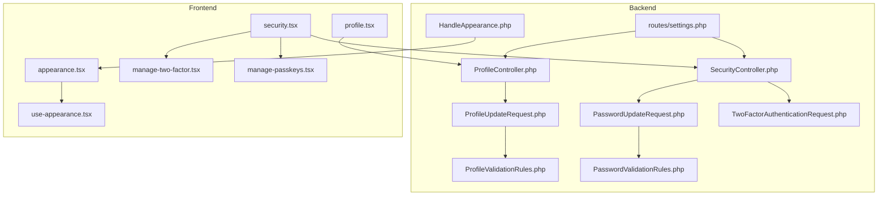
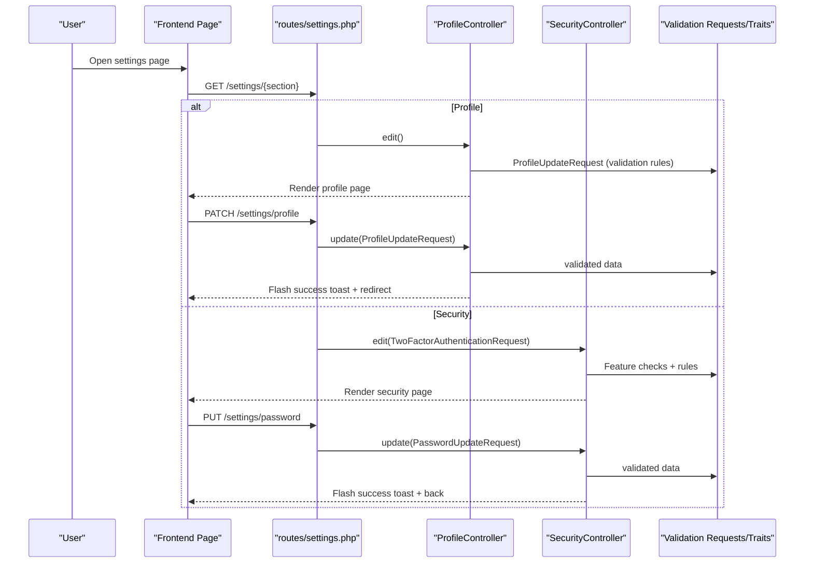
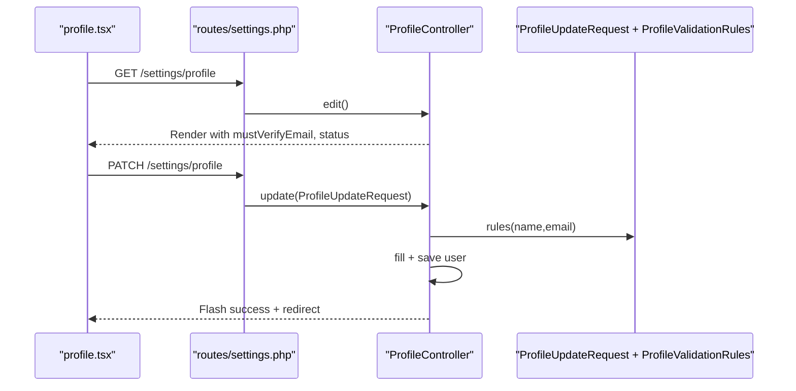
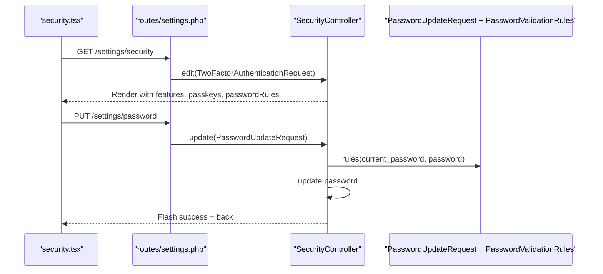
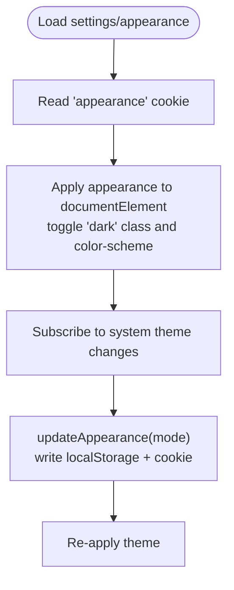
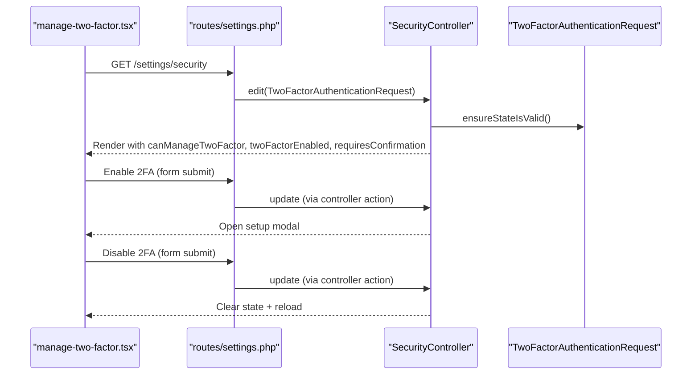
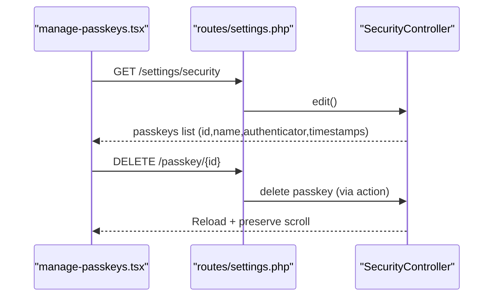
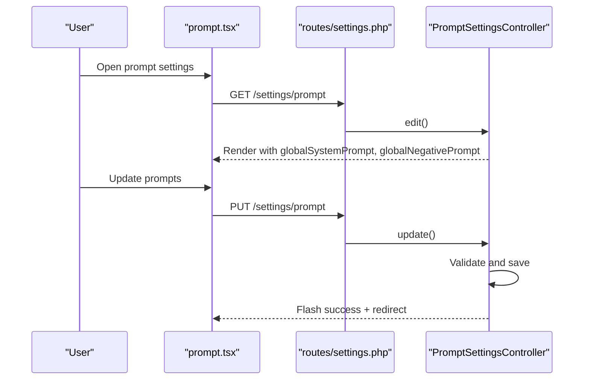
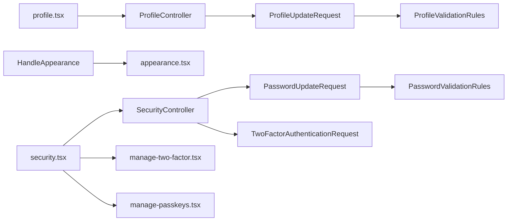

# Settings & Configuration

<cite>
**Referenced Files in This Document**
- [ProfileController.php](file://app/Http/Controllers/Settings/ProfileController.php)
- [SecurityController.php](file://app/Http/Controllers/Settings/SecurityController.php)
- [ProfileUpdateRequest.php](file://app/Http/Requests/Settings/ProfileUpdateRequest.php)
- [PasswordUpdateRequest.php](file://app/Http/Requests/Settings/PasswordUpdateRequest.php)
- [TwoFactorAuthenticationRequest.php](file://app/Http/Requests/Settings/TwoFactorAuthenticationRequest.php)
- [ProfileValidationRules.php](file://app/Concerns/ProfileValidationRules.php)
- [PasswordValidationRules.php](file://app/Concerns/PasswordValidationRules.php)
- [HandleAppearance.php](file://app/Http/Middleware/HandleAppearance.php)
- [settings.php](file://routes/settings.php)
- [appearance.tsx](file://resources/js/pages/settings/appearance.tsx)
- [profile.tsx](file://resources/js/pages/settings/profile.tsx)
- [security.tsx](file://resources/js/pages/settings/security.tsx)
- [manage-two-factor.tsx](file://resources/js/components/manage-two-factor.tsx)
- [manage-passkeys.tsx](file://resources/js/components/manage-passkeys.tsx)
- [use-appearance.tsx](file://resources/js/hooks/use-appearance.tsx)
</cite>

## Table of Contents
1. [Introduction](#introduction)
2. [Project Structure](#project-structure)
3. [Core Components](#core-components)
4. [Architecture Overview](#architecture-overview)
5. [Detailed Component Analysis](#detailed-component-analysis)
6. [Dependency Analysis](#dependency-analysis)
7. [Performance Considerations](#performance-considerations)
8. [Troubleshooting Guide](#troubleshooting-guide)
9. [Conclusion](#conclusion)

## Introduction
This document explains the settings and configuration subsystem in ScholarGraph, focusing on profile management, security settings and preferences, appearance and theme customization, and two-factor authentication management. It covers the backend controllers, form request validation, frontend settings pages, and integration with the authentication system. It also outlines settings update workflows, validation rules, and user preference handling patterns.

## Project Structure
The settings feature spans backend controllers and requests, frontend pages and components, and shared middleware for appearance. Routes define the entry points and protection policies.

**Diagram sources**
- [ProfileController.php:15-62](file://app/Http/Controllers/Settings/ProfileController.php#L15-L62)
- [SecurityController.php:14-66](file://app/Http/Controllers/Settings/SecurityController.php#L14-L66)
- [ProfileUpdateRequest.php:9-22](file://app/Http/Requests/Settings/ProfileUpdateRequest.php#L9-L22)
- [PasswordUpdateRequest.php:9-25](file://app/Http/Requests/Settings/PasswordUpdateRequest.php#L9-L25)
- [TwoFactorAuthenticationRequest.php:9-22](file://app/Http/Requests/Settings/TwoFactorAuthenticationRequest.php#L9-L22)
- [ProfileValidationRules.php:9-51](file://app/Concerns/ProfileValidationRules.php#L9-L51)
- [PasswordValidationRules.php:8-29](file://app/Concerns/PasswordValidationRules.php#L8-L29)
- [HandleAppearance.php:10-23](file://app/Http/Middleware/HandleAppearance.php#L10-L23)
- [settings.php:1-35](file://routes/settings.php#L1-L35)
- [appearance.tsx:1-33](file://resources/js/pages/settings/appearance.tsx#L1-L33)
- [profile.tsx:1-139](file://resources/js/pages/settings/profile.tsx#L1-L139)
- [security.tsx:1-148](file://resources/js/pages/settings/security.tsx#L1-L148)
- [manage-two-factor.tsx:1-127](file://resources/js/components/manage-two-factor.tsx#L1-L127)
- [manage-passkeys.tsx:1-72](file://resources/js/components/manage-passkeys.tsx#L1-L72)
- [use-appearance.tsx:1-116](file://resources/js/hooks/use-appearance.tsx#L1-L116)

**Section sources**
- [settings.php:1-35](file://routes/settings.php#L1-L35)

## Core Components
- ProfileController: Renders the profile settings page, updates profile attributes, and deletes the user account after logout and session invalidation.
- SecurityController: Renders the security settings page, manages password updates, and integrates with two-factor authentication and passkeys features.
- PromptSettingsController: Renders the global prompt settings page and manages global system and negative prompts.
- Form Requests: Encapsulate validation rules for profile updates, password updates, and two-factor state handling.
- Validation Traits: Centralize reusable validation rules for names, emails, and passwords.
- Appearance Middleware: Shares the current appearance mode with the view layer.
- Frontend Pages and Components: Provide the user-facing settings UI for profile, security, appearance, and prompt customization, including two-factor and passkey management.

**Section sources**
- [ProfileController.php:15-62](file://app/Http/Controllers/Settings/ProfileController.php#L15-L62)
- [SecurityController.php:14-66](file://app/Http/Controllers/Settings/SecurityController.php#L14-L66)
- [ProfileUpdateRequest.php:9-22](file://app/Http/Requests/Settings/ProfileUpdateRequest.php#L9-L22)
- [PasswordUpdateRequest.php:9-25](file://app/Http/Requests/Settings/PasswordUpdateRequest.php#L9-L25)
- [TwoFactorAuthenticationRequest.php:9-22](file://app/Http/Requests/Settings/TwoFactorAuthenticationRequest.php#L9-L22)
- [ProfileValidationRules.php:9-51](file://app/Concerns/ProfileValidationRules.php#L9-L51)
- [PasswordValidationRules.php:8-29](file://app/Concerns/PasswordValidationRules.php#L8-L29)
- [HandleAppearance.php:10-23](file://app/Http/Middleware/HandleAppearance.php#L10-L23)
- [profile.tsx:1-139](file://resources/js/pages/settings/profile.tsx#L1-L139)
- [security.tsx:1-148](file://resources/js/pages/settings/security.tsx#L1-L148)
- [appearance.tsx:1-33](file://resources/js/pages/settings/appearance.tsx#L1-L33)

## Architecture Overview
The settings architecture follows a layered pattern:
- Routes define protected endpoints for settings pages and actions.
- Controllers orchestrate rendering and updates, delegating validation to form requests.
- Form requests enforce validation rules via traits.
- Frontend pages render settings UI and delegate actions to controller forms and hooks.
- Middleware ensures appearance preferences are available to the view layer.

**Diagram sources**
- [settings.php:8-27](file://routes/settings.php#L8-L27)
- [ProfileController.php:20-44](file://app/Http/Controllers/Settings/ProfileController.php#L20-L44)
- [SecurityController.php:19-65](file://app/Http/Controllers/Settings/SecurityController.php#L19-L65)
- [ProfileUpdateRequest.php:9-22](file://app/Http/Requests/Settings/ProfileUpdateRequest.php#L9-L22)
- [PasswordUpdateRequest.php:9-25](file://app/Http/Requests/Settings/PasswordUpdateRequest.php#L9-L25)
- [TwoFactorAuthenticationRequest.php:9-22](file://app/Http/Requests/Settings/TwoFactorAuthenticationRequest.php#L9-L22)

## Detailed Component Analysis

### Profile Management
- Controller responsibilities:
  - Edit: renders the profile page and passes verification and status context.
  - Update: applies validated profile data; marks email unverified when changed; persists and flashes a success toast.
  - Destroy: logs out, deletes the user, invalidates session, and redirects to home.
- Validation:
  - Name: required string, max length enforced.
  - Email: required, string, email format, max length, unique per user (excluding self when updating).
- Frontend:
  - Provides editable name and email fields, optional email verification prompt, and a delete user component.

**Diagram sources**
- [profile.tsx:18-128](file://resources/js/pages/settings/profile.tsx#L18-L128)
- [settings.php:11-13](file://routes/settings.php#L11-L13)
- [ProfileController.php:20-44](file://app/Http/Controllers/Settings/ProfileController.php#L20-L44)
- [ProfileUpdateRequest.php:9-22](file://app/Http/Requests/Settings/ProfileUpdateRequest.php#L9-L22)
- [ProfileValidationRules.php:16-50](file://app/Concerns/ProfileValidationRules.php#L16-L50)

**Section sources**
- [ProfileController.php:15-62](file://app/Http/Controllers/Settings/ProfileController.php#L15-L62)
- [ProfileUpdateRequest.php:9-22](file://app/Http/Requests/Settings/ProfileUpdateRequest.php#L9-L22)
- [ProfileValidationRules.php:9-51](file://app/Concerns/ProfileValidationRules.php#L9-L51)
- [profile.tsx:1-139](file://resources/js/pages/settings/profile.tsx#L1-L139)

### Security Settings and Preferences
- Controller responsibilities:
  - Edit: renders security page with feature flags for two-factor and passkeys, passkey list, and password rules string.
  - Update: updates the user’s password using validated request data and flashes a success toast.
- Validation:
  - Password: required, string, strong password rules, confirmed.
  - Current password: required, must match existing password.
- Frontend:
  - Password update form with current/new/confirm fields and focus management on validation errors.
  - Two-factor management component with enable/disable flows and recovery codes.
  - Passkeys management component with registration and deletion flows.

**Diagram sources**
- [security.tsx:20-138](file://resources/js/pages/settings/security.tsx#L20-L138)
- [settings.php:18-24](file://routes/settings.php#L18-L24)
- [SecurityController.php:19-65](file://app/Http/Controllers/Settings/SecurityController.php#L19-L65)
- [PasswordUpdateRequest.php:9-25](file://app/Http/Requests/Settings/PasswordUpdateRequest.php#L9-L25)
- [PasswordValidationRules.php:8-29](file://app/Concerns/PasswordValidationRules.php#L8-L29)

**Section sources**
- [SecurityController.php:14-66](file://app/Http/Controllers/Settings/SecurityController.php#L14-L66)
- [PasswordUpdateRequest.php:9-25](file://app/Http/Requests/Settings/PasswordUpdateRequest.php#L9-L25)
- [PasswordValidationRules.php:8-29](file://app/Concerns/PasswordValidationRules.php#L8-L29)
- [security.tsx:1-148](file://resources/js/pages/settings/security.tsx#L1-L148)

### Appearance and Theme Customization
- Backend:
  - Middleware shares the current appearance mode with the view layer using a cookie-backed preference.
- Frontend:
  - Hook manages local storage and cookie persistence, subscribes to system theme changes, and applies dark/light classes and color-scheme.
  - Settings page renders appearance tabs and delegates to the hook for updates.

**Diagram sources**
- [HandleAppearance.php:17-22](file://app/Http/Middleware/HandleAppearance.php#L17-L22)
- [use-appearance.tsx:73-115](file://resources/js/hooks/use-appearance.tsx#L73-L115)
- [appearance.tsx:1-33](file://resources/js/pages/settings/appearance.tsx#L1-L33)

**Section sources**
- [HandleAppearance.php:10-23](file://app/Http/Middleware/HandleAppearance.php#L10-L23)
- [use-appearance.tsx:1-116](file://resources/js/hooks/use-appearance.tsx#L1-L116)
- [appearance.tsx:1-33](file://resources/js/pages/settings/appearance.tsx#L1-L33)

### Two-Factor Authentication Management
- Frontend:
  - ManageTwoFactor component orchestrates enabling/disabling 2FA, displays QR setup modal, and shows recovery codes.
  - Uses a dedicated hook to fetch setup data, recovery codes, and clear state appropriately.
- Backend:
  - TwoFactorAuthenticationRequest integrates with the two-factor state handling trait.
  - SecurityController reads feature flags and current state to render appropriate UI.

**Diagram sources**
- [manage-two-factor.tsx:17-125](file://resources/js/components/manage-two-factor.tsx#L17-L125)
- [settings.php:18-24](file://routes/settings.php#L18-L24)
- [SecurityController.php:19-51](file://app/Http/Controllers/Settings/SecurityController.php#L19-L51)
- [TwoFactorAuthenticationRequest.php:9-22](file://app/Http/Requests/Settings/TwoFactorAuthenticationRequest.php#L9-L22)

**Section sources**
- [manage-two-factor.tsx:1-127](file://resources/js/components/manage-two-factor.tsx#L1-L127)
- [SecurityController.php:14-66](file://app/Http/Controllers/Settings/SecurityController.php#L14-L66)
- [TwoFactorAuthenticationRequest.php:9-22](file://app/Http/Requests/Settings/TwoFactorAuthenticationRequest.php#L9-L22)

### Passkeys Management
- Frontend:
  - ManagePasskeys lists registered passkeys, supports deletion, and provides a registration component.
  - Deletion uses an action route with scroll preservation and error handling.
- Backend:
  - SecurityController exposes passkeys via feature flag and selects required fields for display.

**Diagram sources**
- [manage-passkeys.tsx:28-71](file://resources/js/components/manage-passkeys.tsx#L28-L71)
- [SecurityController.php:19-50](file://app/Http/Controllers/Settings/SecurityController.php#L19-L50)

**Section sources**
- [manage-passkeys.tsx:1-72](file://resources/js/components/manage-passkeys.tsx#L1-L72)
- [SecurityController.php:14-66](file://app/Http/Controllers/Settings/SecurityController.php#L14-L66)

### Global Prompt Settings
- Backend:
  - PromptSettingsController renders the prompt settings page and manages global system and negative prompts.
  - Validation enforces max length constraints (10000 chars for system prompt, 5000 for negative prompt).
- Frontend:
  - Settings page provides textareas for global system prompt and global negative prompt.
  - Includes a collapsible preview of the default system prompt for reference.
- Per-project prompts:
  - The PromptDrawer component on project pages allows editing per-project prompts and negative prompts.
  - Users can toggle whether to include the global prompt, which is composed with the project prompt.
  - Suggested prompt chips allow quick addition of common patterns.

**Diagram sources**
- [PromptSettingsController.php:14-41](file://app/Http/Controllers/Settings/PromptSettingsController.php#L14-L41)
- [prompt.tsx:1-130](file://resources/js/pages/settings/prompt.tsx#L1-L130)
- [settings.php:26-28](file://routes/settings.php#L26-L28)

**Section sources**
- [PromptSettingsController.php:1-43](file://app/Http/Controllers/Settings/PromptSettingsController.php#L1-L43)
- [prompt.tsx:1-130](file://resources/js/pages/settings/prompt.tsx#L1-L130)
- [prompt-drawer.tsx:1-265](file://resources/js/components/prompt-drawer.tsx#L1-L265)

## Dependency Analysis
- Controllers depend on form requests for validation and on Laravel Fortify features for two-factor and passkeys.
- Form requests depend on validation traits for reusable rules.
- Frontend pages depend on controller forms and hooks for actions and state.
- Middleware depends on cookies for SSR appearance sharing.

**Diagram sources**
- [ProfileController.php:15-62](file://app/Http/Controllers/Settings/ProfileController.php#L15-L62)
- [ProfileUpdateRequest.php:9-22](file://app/Http/Requests/Settings/ProfileUpdateRequest.php#L9-L22)
- [ProfileValidationRules.php:9-51](file://app/Concerns/ProfileValidationRules.php#L9-L51)
- [SecurityController.php:14-66](file://app/Http/Controllers/Settings/SecurityController.php#L14-L66)
- [PasswordUpdateRequest.php:9-25](file://app/Http/Requests/Settings/PasswordUpdateRequest.php#L9-L25)
- [PasswordValidationRules.php:8-29](file://app/Concerns/PasswordValidationRules.php#L8-L29)
- [TwoFactorAuthenticationRequest.php:9-22](file://app/Http/Requests/Settings/TwoFactorAuthenticationRequest.php#L9-L22)
- [HandleAppearance.php:10-23](file://app/Http/Middleware/HandleAppearance.php#L10-L23)
- [appearance.tsx:1-33](file://resources/js/pages/settings/appearance.tsx#L1-L33)
- [profile.tsx:1-139](file://resources/js/pages/settings/profile.tsx#L1-L139)
- [security.tsx:1-148](file://resources/js/pages/settings/security.tsx#L1-L148)
- [manage-two-factor.tsx:1-127](file://resources/js/components/manage-two-factor.tsx#L1-L127)
- [manage-passkeys.tsx:1-72](file://resources/js/components/manage-passkeys.tsx#L1-L72)

**Section sources**
- [settings.php:1-35](file://routes/settings.php#L1-L35)

## Performance Considerations
- Minimize database writes: Profile updates only persist when data changes; email changes trigger verification reset but avoid unnecessary saves.
- Efficient passkey queries: SecurityController limits selected fields and orders by latest creation time.
- Client-side persistence: Appearance hook avoids repeated DOM operations by applying classes once and notifying subscribers.
- Request throttling: Password update endpoint is rate-limited to reduce abuse.

[No sources needed since this section provides general guidance]

## Troubleshooting Guide
- Profile update fails validation:
  - Verify name and email constraints; ensure uniqueness against existing records.
  - On email change, expect verification reset until the new address is verified.
- Password update errors:
  - Ensure current password matches and new password satisfies strength rules and confirmation.
  - Focus moves to the first invalid field for quick correction.
- Two-factor setup issues:
  - Confirm feature availability and that state is valid before enabling.
  - Use recovery codes after enabling to avoid lockout.
- Passkey management:
  - Registration refreshes the list; deletion preserves scroll and handles errors gracefully.
- Appearance not applying:
  - Check cookie and local storage values; ensure system theme listener is active.

**Section sources**
- [ProfileValidationRules.php:16-50](file://app/Concerns/ProfileValidationRules.php#L16-L50)
- [PasswordValidationRules.php:15-28](file://app/Concerns/PasswordValidationRules.php#L15-L28)
- [SecurityController.php:19-51](file://app/Http/Controllers/Settings/SecurityController.php#L19-L51)
- [manage-two-factor.tsx:35-41](file://resources/js/components/manage-two-factor.tsx#L35-L41)
- [manage-passkeys.tsx:31-40](file://resources/js/components/manage-passkeys.tsx#L31-L40)
- [use-appearance.tsx:73-88](file://resources/js/hooks/use-appearance.tsx#L73-L88)

## Conclusion
ScholarGraph’s settings subsystem cleanly separates concerns between backend controllers and requests, reusable validation traits, and a cohesive frontend experience. Profile, security, and appearance settings are integrated with authentication protections and feature flags, while user preference handling ensures a responsive and accessible interface across devices and sessions.

[No sources needed since this section summarizes without analyzing specific files]