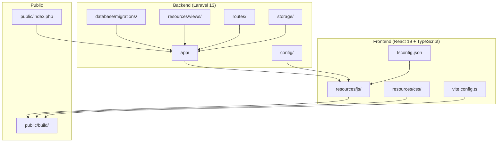
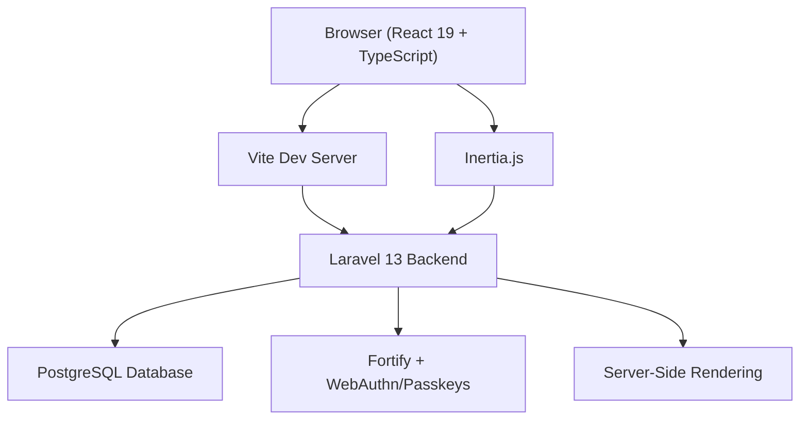
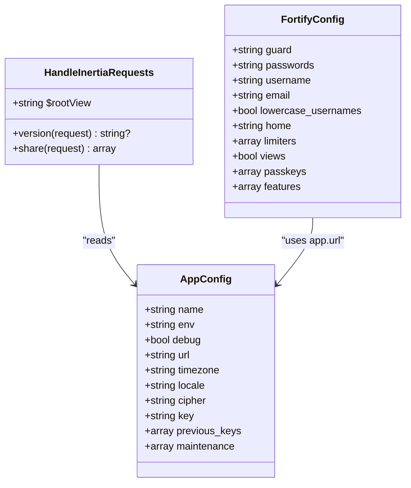
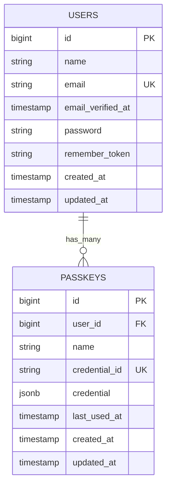
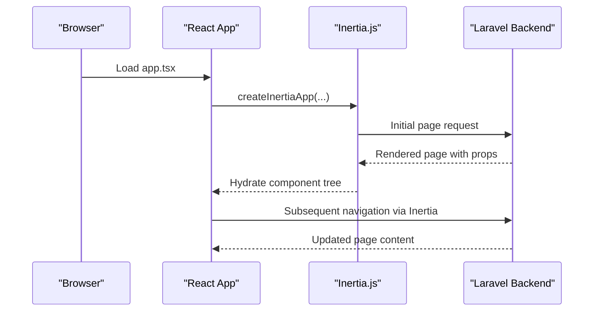
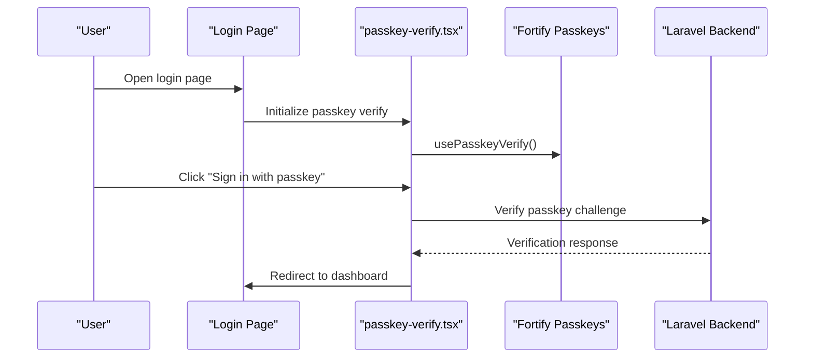
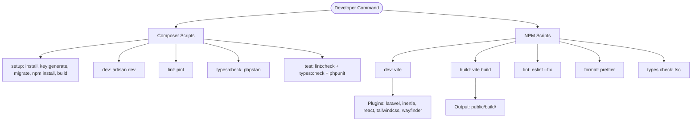
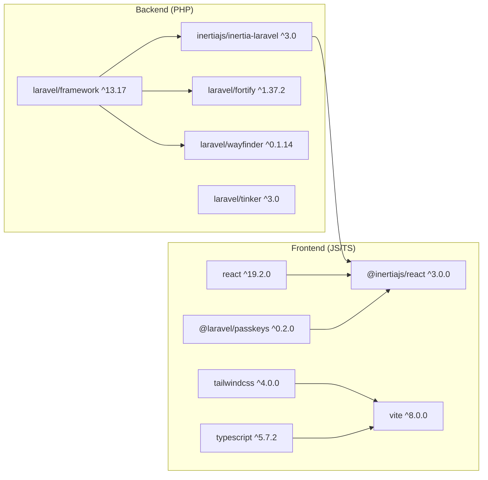

# Technology Stack & Dependencies

<cite>
**Referenced Files in This Document**
- [composer.json](file://composer.json)
- [package.json](file://package.json)
- [vite.config.ts](file://vite.config.ts)
- [tsconfig.json](file://tsconfig.json)
- [config/app.php](file://config/app.php)
- [config/database.php](file://config/database.php)
- [config/fortify.php](file://config/fortify.php)
- [config/inertia.php](file://config/inertia.php)
- [database/migrations/0001_01_01_000000_create_users_table.php](file://database/migrations/0001_01_01_000000_create_users_table.php)
- [database/migrations/2024_01_01_000000_create_passkeys_table.php](file://database/migrations/2024_01_01_000000_create_passkeys_table.php)
- [app/Http/Middleware/HandleInertiaRequests.php](file://app/Http/Middleware/HandleInertiaRequests.php)
- [resources/js/app.tsx](file://resources/js/app.tsx)
- [resources/js/components/manage-passkeys.tsx](file://resources/js/components/manage-passkeys.tsx)
- [resources/js/components/passkey-register.tsx](file://resources/js/components/passkey-register.tsx)
- [resources/js/components/passkey-verify.tsx](file://resources/js/components/passkey-verify.tsx)
</cite>

## Table of Contents
1. [Introduction](#introduction)
2. [Project Structure](#project-structure)
3. [Core Components](#core-components)
4. [Architecture Overview](#architecture-overview)
5. [Detailed Component Analysis](#detailed-component-analysis)
6. [Dependency Analysis](#dependency-analysis)
7. [Performance Considerations](#performance-considerations)
8. [Troubleshooting Guide](#troubleshooting-guide)
9. [Conclusion](#conclusion)

## Introduction
This document provides comprehensive technology stack documentation for ScholarGraph, detailing the full-stack architecture built on Laravel 13 with PHP 8.3, a React 19 frontend with TypeScript, PostgreSQL database support, and Inertia.js for seamless Single Page Application (SPA) transitions. It also covers external service integrations, authentication via WebAuthn/passkeys, and the rationale behind technology choices, dependency versions, and integration patterns. Development dependencies, build tools configuration, and deployment considerations are included for both high-level understanding and technical implementation details.

## Project Structure
ScholarGraph follows a modern full-stack Laravel + React monorepo structure with clear separation of concerns:
- Backend: Laravel 13 application under the app/ directory, with configuration under config/, database migrations under database/migrations/, and HTTP middleware under app/Http/Middleware/.
- Frontend: React 19 application under resources/js/, TypeScript configuration under tsconfig.json, and Vite build tooling under vite.config.ts.
- Assets and Views: Blade templates under resources/views/ and compiled assets under public/.
- Tests: Feature and unit tests under tests/.

**Diagram sources**
- [composer.json:11-32](file://composer.json#L11-L32)
- [package.json:15-76](file://package.json#L15-L76)
- [vite.config.ts:1-32](file://vite.config.ts#L1-L32)
- [tsconfig.json:111-121](file://tsconfig.json#L111-L121)

**Section sources**
- [composer.json:11-32](file://composer.json#L11-L32)
- [package.json:15-76](file://package.json#L15-L76)
- [vite.config.ts:1-32](file://vite.config.ts#L1-L32)
- [tsconfig.json:111-121](file://tsconfig.json#L111-L121)

## Core Components
- Laravel 13 backend with PHP 8.3: Provides the RESTful API, authentication, middleware, and Inertia SSR integration. Configuration includes application settings, database connections, and Fortify passkey/WebAuthn support.
- React 19 frontend with TypeScript: Implements UI components, layouts, and client-side navigation via Inertia.js. TypeScript enforces strict typing and improves developer experience.
- PostgreSQL database: Configured via Laravel's database.php with pgsql driver support. JSONB is leveraged in the passkeys credential column for structured passkey data.
- Inertia.js: Bridges Laravel and React, enabling seamless SPA transitions while preserving server-side rendering capabilities.
- Authentication: Fortify with WebAuthn/passkeys for passwordless login, complemented by traditional email/password and two-factor authentication.

**Section sources**
- [composer.json:11-18](file://composer.json#L11-L18)
- [package.json:31-66](file://package.json#L31-L66)
- [config/database.php:87-100](file://config/database.php#L87-L100)
- [config/fortify.php:145-150](file://config/fortify.php#L145-L150)
- [config/inertia.php:18-23](file://config/inertia.php#L18-L23)

## Architecture Overview
The system architecture integrates Laravel as the backend orchestrator with React as the frontend renderer. Inertia.js facilitates server-to-client navigation, while PostgreSQL stores user and passkey data. Fortify manages authentication flows, including passkeys/WebAuthn.

**Diagram sources**
- [resources/js/app.tsx:11-37](file://resources/js/app.tsx#L11-L37)
- [config/inertia.php:18-23](file://config/inertia.php#L18-L23)
- [config/fortify.php:145-150](file://config/fortify.php#L145-L150)
- [config/database.php:87-100](file://config/database.php#L87-L100)

## Detailed Component Analysis

### Backend: Laravel 13 + Inertia + Fortify
- Application configuration: Centralized in config/app.php, including name, environment, debug, URL, timezone, locale, encryption cipher, and maintenance settings.
- Database configuration: Supports SQLite, MySQL, MariaDB, PostgreSQL, and SQL Server. PostgreSQL is configured with charset, prefix, SSL mode, and search path.
- Inertia middleware: Handles shared data (application name, authenticated user, sidebar state) and root view resolution for SSR.
- Authentication: Fortify provides registration, password reset, email verification, two-factor authentication, and passkeys/WebAuthn. Passkey relying party settings align with app URL and allowed origins.

**Diagram sources**
- [app/Http/Middleware/HandleInertiaRequests.php:8-47](file://app/Http/Middleware/HandleInertiaRequests.php#L8-L47)
- [config/fortify.php:18-175](file://config/fortify.php#L18-L175)
- [config/app.php:16-124](file://config/app.php#L16-L124)

**Section sources**
- [config/app.php:16-124](file://config/app.php#L16-L124)
- [config/database.php:87-100](file://config/database.php#L87-L100)
- [app/Http/Middleware/HandleInertiaRequests.php:8-47](file://app/Http/Middleware/HandleInertiaRequests.php#L8-L47)
- [config/fortify.php:18-175](file://config/fortify.php#L18-L175)

### Database Schema: Users and Passkeys
- Users table: Standard Laravel user schema with timestamps, remember tokens, and password reset tokens.
- Passkeys table: Stores passkey credentials as JSONB for structured data, with foreign key relationship to users and indexing for performance.

**Diagram sources**
- [database/migrations/0001_01_01_000000_create_users_table.php:14-37](file://database/migrations/0001_01_01_000000_create_users_table.php#L14-L37)
- [database/migrations/2024_01_01_000000_create_passkeys_table.php:14-24](file://database/migrations/2024_01_01_000000_create_passkeys_table.php#L14-L24)

**Section sources**
- [database/migrations/0001_01_01_000000_create_users_table.php:14-37](file://database/migrations/0001_01_01_000000_create_users_table.php#L14-L37)
- [database/migrations/2024_01_01_000000_create_passkeys_table.php:14-24](file://database/migrations/2024_01_01_000000_create_passkeys_table.php#L14-L24)

### Frontend: React 19 + TypeScript + Inertia
- Application bootstrapping: resources/js/app.tsx configures Inertia app name, layout selection by route pattern, strict mode, global providers, and progress bar color.
- Passkey components: manage-passkeys.tsx lists and deletes passkeys, passkey-register.tsx handles passkey registration with device/browser detection, and passkey-verify.tsx performs passkey verification with fallback options.

**Diagram sources**
- [resources/js/app.tsx:11-37](file://resources/js/app.tsx#L11-L37)
- [config/inertia.php:36-51](file://config/inertia.php#L36-L51)

**Section sources**
- [resources/js/app.tsx:11-37](file://resources/js/app.tsx#L11-L37)
- [resources/js/components/manage-passkeys.tsx:28-71](file://resources/js/components/manage-passkeys.tsx#L28-L71)
- [resources/js/components/passkey-register.tsx:12-109](file://resources/js/components/passkey-register.tsx#L12-L109)
- [resources/js/components/passkey-verify.tsx:20-74](file://resources/js/components/passkey-verify.tsx#L20-L74)

### Authentication Flow: Passkeys/WebAuthn
The passkey authentication flow integrates Fortify with @laravel/passkeys/react to enable passwordless login.

**Diagram sources**
- [resources/js/components/passkey-verify.tsx:26-36](file://resources/js/components/passkey-verify.tsx#L26-L36)
- [config/fortify.php:145-150](file://config/fortify.php#L145-L150)

**Section sources**
- [resources/js/components/passkey-verify.tsx:26-36](file://resources/js/components/passkey-verify.tsx#L26-L36)
- [config/fortify.php:145-150](file://config/fortify.php#L145-L150)

### Build Tooling and Scripts
- Composer scripts: Setup, dev, lint, types checking, CI checks, and test orchestration.
- NPM scripts: Vite dev/build, ESLint, Prettier, and TypeScript type checking.
- Vite configuration: Laravel plugin, Inertia plugin, React compiler, TailwindCSS, Wayfinder, and font delivery via Bunny CDN.
- TypeScript configuration: Strict mode, ESNext target, bundler module resolution, path aliases, and JSX transform.

**Diagram sources**
- [composer.json:45-99](file://composer.json#L45-L99)
- [package.json:5-14](file://package.json#L5-L14)
- [vite.config.ts:9-31](file://vite.config.ts#L9-L31)
- [tsconfig.json:2-121](file://tsconfig.json#L2-L121)

**Section sources**
- [composer.json:45-99](file://composer.json#L45-L99)
- [package.json:5-14](file://package.json#L5-L14)
- [vite.config.ts:9-31](file://vite.config.ts#L9-L31)
- [tsconfig.json:2-121](file://tsconfig.json#L2-L121)

## Dependency Analysis
- Backend dependencies: Laravel framework 13, Inertia for Laravel, Laravel Fortify for authentication, Laravel Wayfinder for routing, and Tinker for REPL.
- Frontend dependencies: Inertia for React, @laravel/passkeys for passkeys/WebAuthn, Radix UI primitives, Tailwind CSS v4, React 19, TypeScript, and Vite.
- Development dependencies: Laravel Boost, Laravel Sail, Pest for testing, Larastan for static analysis, Pint for PHP formatting, Collision for error handling, and ESLint/Prettier/TSC for frontend quality.

**Diagram sources**
- [composer.json:11-18](file://composer.json#L11-L18)
- [package.json:31-66](file://package.json#L31-L66)

**Section sources**
- [composer.json:11-18](file://composer.json#L11-L18)
- [package.json:31-66](file://package.json#L31-L66)

## Performance Considerations
- Database: PostgreSQL is configured with appropriate charset, SSL mode, and search path. Indexing on passkeys.user_id supports efficient lookups.
- SSR: Inertia SSR is enabled and configured to run on localhost, reducing initial load time and improving SEO.
- Asset pipeline: Vite with React compiler and TailwindCSS ensures optimized builds and fast development reloads.
- Type safety: Strict TypeScript configuration reduces runtime errors and improves maintainability.
- Authentication: Passkeys eliminate password-related overhead and improve user experience.

[No sources needed since this section provides general guidance]

## Troubleshooting Guide
- Authentication issues: Verify Fortify passkeys configuration (relying party ID, allowed origins, user handle secret) and ensure app URL matches browser origin.
- Database connectivity: Confirm PostgreSQL connection settings in config/database.php and environment variables for host, port, database, username, and password.
- Inertia SSR: Ensure SSR server is reachable at the configured URL and that the bundle path is correct.
- Passkey registration/verification: Check browser support for WebAuthn, device compatibility, and proper error handling in passkey-register.tsx and passkey-verify.tsx.
- Asset build failures: Validate Vite plugins and ensure node_modules are installed; check TypeScript configuration for path aliases and module resolution.

**Section sources**
- [config/fortify.php:145-150](file://config/fortify.php#L145-L150)
- [config/database.php:87-100](file://config/database.php#L87-L100)
- [config/inertia.php:18-23](file://config/inertia.php#L18-L23)
- [resources/js/components/passkey-register.tsx:36-52](file://resources/js/components/passkey-register.tsx#L36-L52)
- [resources/js/components/passkey-verify.tsx:26-36](file://resources/js/components/passkey-verify.tsx#L26-L36)

## Conclusion
ScholarGraph leverages a modern full-stack architecture combining Laravel 13 with PHP 8.3, React 19 with TypeScript, PostgreSQL, and Inertia.js for seamless SPA transitions. Fortify and @laravel/passkeys deliver robust, passwordless authentication via WebAuthn. The build toolchain (Vite, ESLint, Prettier, TypeScript) ensures high-quality development and production-ready assets. This stack balances developer productivity, scalability, and user experience, with clear integration patterns and strong performance characteristics.