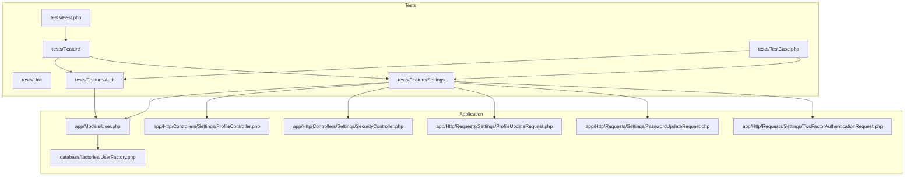
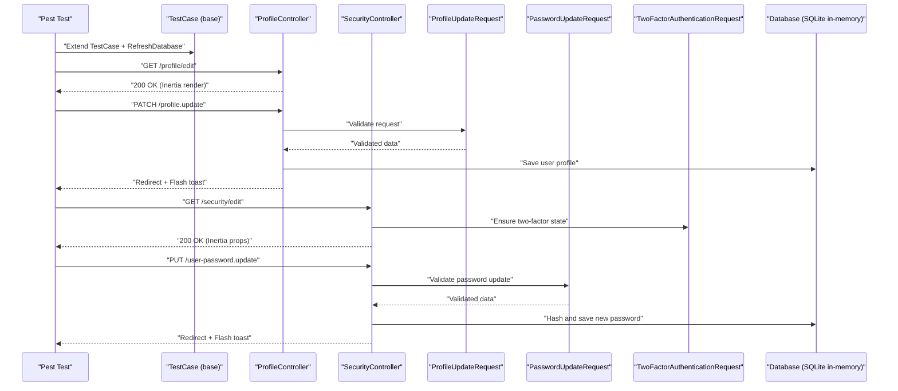
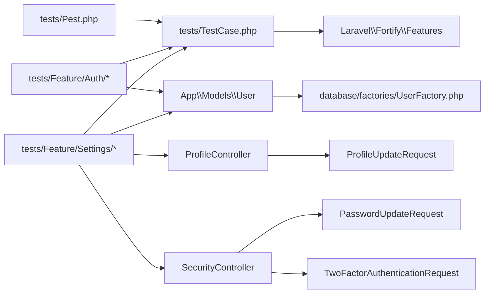

# Testing Strategy

<cite>
**Referenced Files in This Document**
- [phpunit.xml](file://phpunit.xml)
- [tests/Pest.php](file://tests/Pest.php)
- [tests/TestCase.php](file://tests/TestCase.php)
- [tests/Feature/Auth/AuthenticationTest.php](file://tests/Feature/Auth/AuthenticationTest.php)
- [tests/Feature/Auth/RegistrationTest.php](file://tests/Feature/Auth/RegistrationTest.php)
- [tests/Feature/DashboardTest.php](file://tests/Feature/DashboardTest.php)
- [tests/Feature/Settings/ProfileUpdateTest.php](file://tests/Feature/Settings/ProfileUpdateTest.php)
- [tests/Feature/Settings/SecurityTest.php](file://tests/Feature/Settings/SecurityTest.php)
- [app/Http/Controllers/Settings/ProfileController.php](file://app/Http/Controllers/Settings/ProfileController.php)
- [app/Http/Controllers/Settings/SecurityController.php](file://app/Http/Controllers/Settings/SecurityController.php)
- [app/Http/Requests/Settings/ProfileUpdateRequest.php](file://app/Http/Requests/Settings/ProfileUpdateRequest.php)
- [app/Http/Requests/Settings/PasswordUpdateRequest.php](file://app/Http/Requests/Settings/PasswordUpdateRequest.php)
- [app/Http/Requests/Settings/TwoFactorAuthenticationRequest.php](file://app/Http/Requests/Settings/TwoFactorAuthenticationRequest.php)
- [app/Concerns/PasswordValidationRules.php](file://app/Concerns/PasswordValidationRules.php)
- [app/Concerns/ProfileValidationRules.php](file://app/Concerns/ProfileValidationRules.php)
- [app/Models/User.php](file://app/Models/User.php)
- [database/factories/UserFactory.php](file://database/factories/UserFactory.php)
- [.github/workflows](file://.github/workflows)
</cite>

## Table of Contents
1. [Introduction](#introduction)
2. [Project Structure](#project-structure)
3. [Core Components](#core-components)
4. [Architecture Overview](#architecture-overview)
5. [Detailed Component Analysis](#detailed-component-analysis)
6. [Dependency Analysis](#dependency-analysis)
7. [Performance Considerations](#performance-considerations)
8. [Troubleshooting Guide](#troubleshooting-guide)
9. [Conclusion](#conclusion)
10. [Appendices](#appendices)

## Introduction
This document defines a comprehensive testing strategy for ScholarGraph. It covers PHPUnit test suite organization, Pest testing framework usage, and feature testing patterns. It documents authentication testing, API endpoint testing, and integration testing approaches. It explains test case structure, mock implementations, and assertion patterns used across the application. Best practices for Laravel applications, React components, and API endpoints are included, along with examples of test implementations and strategies for different application layers. Continuous integration considerations and automated testing workflows are addressed.

## Project Structure
The testing structure follows Laravel conventions with separate suites for unit and feature tests. Pest is configured to extend the base test case and automatically apply database refresh for feature tests. PHPUnit configuration sets up an in-memory SQLite database and disables external services for fast, isolated tests.

**Diagram sources**
- [tests/Pest.php:17-19](file://tests/Pest.php#L17-L19)
- [tests/TestCase.php:8-16](file://tests/TestCase.php#L8-L16)
- [tests/Feature/Auth/AuthenticationTest.php:1-77](file://tests/Feature/Auth/AuthenticationTest.php#L1-L77)
- [tests/Feature/Settings/ProfileUpdateTest.php:1-85](file://tests/Feature/Settings/ProfileUpdateTest.php#L1-L85)
- [tests/Feature/Settings/SecurityTest.php:1-104](file://tests/Feature/Settings/SecurityTest.php#L1-L104)
- [app/Http/Controllers/Settings/ProfileController.php:15-63](file://app/Http/Controllers/Settings/ProfileController.php#L15-L63)
- [app/Http/Controllers/Settings/SecurityController.php:14-67](file://app/Http/Controllers/Settings/SecurityController.php#L14-L67)
- [app/Http/Requests/Settings/ProfileUpdateRequest.php:9-23](file://app/Http/Requests/Settings/ProfileUpdateRequest.php#L9-L23)
- [app/Http/Requests/Settings/PasswordUpdateRequest.php:9-26](file://app/Http/Requests/Settings/PasswordUpdateRequest.php#L9-L26)
- [app/Http/Requests/Settings/TwoFactorAuthenticationRequest.php:9-23](file://app/Http/Requests/Settings/TwoFactorAuthenticationRequest.php#L9-L23)
- [app/Models/User.php](file://app/Models/User.php)
- [database/factories/UserFactory.php](file://database/factories/UserFactory.php)

**Section sources**
- [phpunit.xml:7-14](file://phpunit.xml#L7-L14)
- [phpunit.xml:20-35](file://phpunit.xml#L20-L35)
- [tests/Pest.php:17-19](file://tests/Pest.php#L17-L19)
- [tests/TestCase.php:8-16](file://tests/TestCase.php#L8-L16)

## Core Components
- PHPUnit configuration defines test suites and environment variables for a fast, isolated test environment using an in-memory SQLite database and array-backed caches and queues.
- Pest configuration extends the base test case, applies database refresh, and scopes expectations to the Feature directory.
- Shared test base class provides helper methods to conditionally skip tests based on Fortify feature flags.

Key behaviors:
- Environment isolation via SQLite in-memory database and array stores.
- Automatic database refresh per feature test via Pest extension.
- Conditional test skipping for Fortify features.

**Section sources**
- [phpunit.xml:1-37](file://phpunit.xml#L1-L37)
- [tests/Pest.php:17-19](file://tests/Pest.php#L17-L19)
- [tests/TestCase.php:10-15](file://tests/TestCase.php#L10-L15)

## Architecture Overview
The testing architecture leverages Pest for expressive feature tests and Laravel’s built-in assertions. Feature tests simulate real user journeys through controllers and requests, validating redirects, inertia rendering, and session state. Factories produce deterministic test data, and assertions validate both HTTP responses and model state.

**Diagram sources**
- [tests/Pest.php:17-19](file://tests/Pest.php#L17-L19)
- [tests/Feature/Settings/ProfileUpdateTest.php:5-34](file://tests/Feature/Settings/ProfileUpdateTest.php#L5-L34)
- [tests/Feature/Settings/SecurityTest.php:8-31](file://tests/Feature/Settings/SecurityTest.php#L8-L31)
- [app/Http/Controllers/Settings/ProfileController.php:20-44](file://app/Http/Controllers/Settings/ProfileController.php#L20-L44)
- [app/Http/Controllers/Settings/SecurityController.php:19-65](file://app/Http/Controllers/Settings/SecurityController.php#L19-L65)
- [app/Http/Requests/Settings/ProfileUpdateRequest.php:18-21](file://app/Http/Requests/Settings/ProfileUpdateRequest.php#L18-L21)
- [app/Http/Requests/Settings/PasswordUpdateRequest.php:18-24](file://app/Http/Requests/Settings/PasswordUpdateRequest.php#L18-L24)
- [app/Http/Requests/Settings/TwoFactorAuthenticationRequest.php:18-21](file://app/Http/Requests/Settings/TwoFactorAuthenticationRequest.php#L18-L21)

## Detailed Component Analysis

### Authentication Testing Strategy
Authentication tests cover login, registration, logout, two-factor challenge redirection, invalid credentials, and rate limiting. They use factories to create users and leverage Fortify feature checks to skip tests when features are disabled.

Patterns:
- Use factories to create users and set feature flags via Fortify configuration.
- Assert authentication state transitions and redirects.
- Validate rate limiting behavior using Laravel’s rate limiter.

Representative examples:
- Login screen rendering and successful authentication.
- Two-factor challenge redirection for enabled users.
- Logout and guest state validation.
- Rate limiting on failed attempts.

**Section sources**
- [tests/Feature/Auth/AuthenticationTest.php:7-77](file://tests/Feature/Auth/AuthenticationTest.php#L7-L77)
- [tests/Feature/Auth/RegistrationTest.php:5-25](file://tests/Feature/Auth/RegistrationTest.php#L5-L25)
- [tests/TestCase.php:10-15](file://tests/TestCase.php#L10-L15)

### Authorization and Route Protection
Dashboard tests verify route protection for authenticated users and guest redirection. These tests demonstrate middleware enforcement and session-based authorization.

Patterns:
- Acting as a user to access protected routes.
- Asserting redirects for guests.
- Confirming 200 OK for authenticated users.

**Section sources**
- [tests/Feature/DashboardTest.php:5-16](file://tests/Feature/DashboardTest.php#L5-L16)

### Profile Settings Testing
Profile settings tests validate the profile edit page, updates, email verification status changes, account deletion, and password confirmation requirements.

Patterns:
- Use actingAs to simulate logged-in users.
- Validate inertia rendering and flash messages.
- Assert model changes and session errors.
- Confirm account deletion and session cleanup.

Representative examples:
- Profile edit page rendering.
- Successful profile updates and inertia flash.
- Email verification reset on email change.
- Account deletion with correct password and session invalidation.

**Section sources**
- [tests/Feature/Settings/ProfileUpdateTest.php:5-85](file://tests/Feature/Settings/ProfileUpdateTest.php#L5-L85)
- [app/Http/Controllers/Settings/ProfileController.php:20-61](file://app/Http/Controllers/Settings/ProfileController.php#L20-L61)
- [app/Http/Requests/Settings/ProfileUpdateRequest.php:18-21](file://app/Http/Requests/Settings/ProfileUpdateRequest.php#L18-L21)

### Security Settings Testing
Security settings tests cover the security page rendering, password confirmation requirements, and password updates. They validate inertia props and feature flag-driven UI behavior.

Patterns:
- Configure Fortify features for two-factor and passkeys.
- Assert inertia component rendering and props.
- Validate password update flow and error handling.

Representative examples:
- Security page rendering with feature flags.
- Redirect to password confirmation when required.
- Password update success and validation errors.

**Section sources**
- [tests/Feature/Settings/SecurityTest.php:8-104](file://tests/Feature/Settings/SecurityTest.php#L8-L104)
- [app/Http/Controllers/Settings/SecurityController.php:19-65](file://app/Http/Controllers/Settings/SecurityController.php#L19-L65)
- [app/Http/Requests/Settings/PasswordUpdateRequest.php:18-24](file://app/Http/Requests/Settings/PasswordUpdateRequest.php#L18-L24)
- [app/Http/Requests/Settings/TwoFactorAuthenticationRequest.php:18-21](file://app/Http/Requests/Settings/TwoFactorAuthenticationRequest.php#L18-L21)

### Request Validation Testing
Request classes encapsulate validation rules and reuse concerns for password and profile validation. Tests validate that requests enforce proper validation and return appropriate errors.

Patterns:
- Validate request rules via controller actions.
- Assert session errors for invalid inputs.
- Confirm successful validation for valid inputs.

Representative examples:
- Profile update validation rules.
- Password update validation including current password confirmation.
- Two-factor authentication request state handling.

**Section sources**
- [app/Http/Requests/Settings/ProfileUpdateRequest.php:18-21](file://app/Http/Requests/Settings/ProfileUpdateRequest.php#L18-L21)
- [app/Http/Requests/Settings/PasswordUpdateRequest.php:18-24](file://app/Http/Requests/Settings/PasswordUpdateRequest.php#L18-L24)
- [app/Http/Requests/Settings/TwoFactorAuthenticationRequest.php:18-21](file://app/Http/Requests/Settings/TwoFactorAuthenticationRequest.php#L18-L21)
- [app/Concerns/PasswordValidationRules.php](file://app/Concerns/PasswordValidationRules.php)
- [app/Concerns/ProfileValidationRules.php](file://app/Concerns/ProfileValidationRules.php)

### Mock Implementations and Assertions
Mocking and assertions:
- Use factories to create deterministic users and related data.
- Leverage Pest expectations for concise assertions.
- Use Inertia assertions to validate component rendering and props.
- Assert redirects, session flashes, and guest/authenticated states.

Representative examples:
- Factory usage in authentication and settings tests.
- Inertia assertions for security page props.
- Session error assertions for validation failures.

**Section sources**
- [tests/Feature/Auth/AuthenticationTest.php:14-14](file://tests/Feature/Auth/AuthenticationTest.php#L14-L14)
- [tests/Feature/Settings/ProfileUpdateTest.php:16-16](file://tests/Feature/Settings/ProfileUpdateTest.php#L16-L16)
- [tests/Feature/Settings/SecurityTest.php:19-19](file://tests/Feature/Settings/SecurityTest.php#L19-L19)

## Dependency Analysis
The test suite depends on Laravel’s testing traits, Pest extensions, and Fortify feature flags. Controllers depend on request validation classes and Fortify features. Factories provide deterministic data for tests.

**Diagram sources**
- [tests/Pest.php:17-19](file://tests/Pest.php#L17-L19)
- [tests/TestCase.php:10-15](file://tests/TestCase.php#L10-L15)
- [tests/Feature/Auth/AuthenticationTest.php:3-5](file://tests/Feature/Auth/AuthenticationTest.php#L3-L5)
- [tests/Feature/Settings/ProfileUpdateTest.php:3](file://tests/Feature/Settings/ProfileUpdateTest.php#L3)
- [tests/Feature/Settings/SecurityTest.php:3-4](file://tests/Feature/Settings/SecurityTest.php#L3-L4)
- [app/Http/Controllers/Settings/ProfileController.php:5-13](file://app/Http/Controllers/Settings/ProfileController.php#L5-L13)
- [app/Http/Controllers/Settings/SecurityController.php:5-12](file://app/Http/Controllers/Settings/SecurityController.php#L5-L12)
- [app/Http/Requests/Settings/ProfileUpdateRequest.php:5-11](file://app/Http/Requests/Settings/ProfileUpdateRequest.php#L5-L11)
- [app/Http/Requests/Settings/PasswordUpdateRequest.php:5-11](file://app/Http/Requests/Settings/PasswordUpdateRequest.php#L5-L11)
- [app/Http/Requests/Settings/TwoFactorAuthenticationRequest.php:7](file://app/Http/Requests/Settings/TwoFactorAuthenticationRequest.php#L7)
- [app/Models/User.php](file://app/Models/User.php)
- [database/factories/UserFactory.php](file://database/factories/UserFactory.php)

**Section sources**
- [tests/Pest.php:17-19](file://tests/Pest.php#L17-L19)
- [tests/TestCase.php:10-15](file://tests/TestCase.php#L10-L15)
- [app/Http/Controllers/Settings/ProfileController.php:5-13](file://app/Http/Controllers/Settings/ProfileController.php#L5-L13)
- [app/Http/Controllers/Settings/SecurityController.php:5-12](file://app/Http/Controllers/Settings/SecurityController.php#L5-L12)
- [app/Http/Requests/Settings/ProfileUpdateRequest.php:5-11](file://app/Http/Requests/Settings/ProfileUpdateRequest.php#L5-L11)
- [app/Http/Requests/Settings/PasswordUpdateRequest.php:5-11](file://app/Http/Requests/Settings/PasswordUpdateRequest.php#L5-L11)
- [app/Http/Requests/Settings/TwoFactorAuthenticationRequest.php:7](file://app/Http/Requests/Settings/TwoFactorAuthenticationRequest.php#L7)

## Performance Considerations
- Use in-memory SQLite for tests to avoid disk I/O overhead.
- Apply RefreshDatabase trait selectively to minimize teardown costs.
- Keep tests focused and fast; avoid unnecessary database writes.
- Use factories to create minimal, deterministic datasets.

[No sources needed since this section provides general guidance]

## Troubleshooting Guide
Common issues and resolutions:
- Fortify feature disabled: Use the shared helper to skip tests when features are off.
- Rate limiting failures: Adjust limiter increments in tests to simulate throttling.
- Inertia assertions failing: Verify component names and props passed to the inertia render.
- Session errors not appearing: Ensure password confirmation steps are simulated via session state.

**Section sources**
- [tests/TestCase.php:10-15](file://tests/TestCase.php#L10-L15)
- [tests/Feature/Auth/AuthenticationTest.php:66-77](file://tests/Feature/Auth/AuthenticationTest.php#L66-L77)
- [tests/Feature/Settings/SecurityTest.php:33-47](file://tests/Feature/Settings/SecurityTest.php#L33-L47)

## Conclusion
ScholarGraph’s testing strategy combines Pest’s expressive feature tests with Laravel’s robust testing infrastructure. The suite emphasizes authentication flows, settings management, and request validation while leveraging factories and inertia assertions for realistic scenarios. Environment isolation and feature-flag-aware tests ensure reliability and maintainability across environments and configurations.

[No sources needed since this section summarizes without analyzing specific files]

## Appendices

### CI and Automated Testing Workflows
- Define jobs to install dependencies, prepare the database, and run PHPUnit and Pest tests.
- Use matrix builds to test against supported PHP and Laravel versions.
- Cache Composer and NPM dependencies to speed up pipelines.
- Run static analysis and linting alongside tests for quality gates.

[No sources needed since this section provides general guidance]