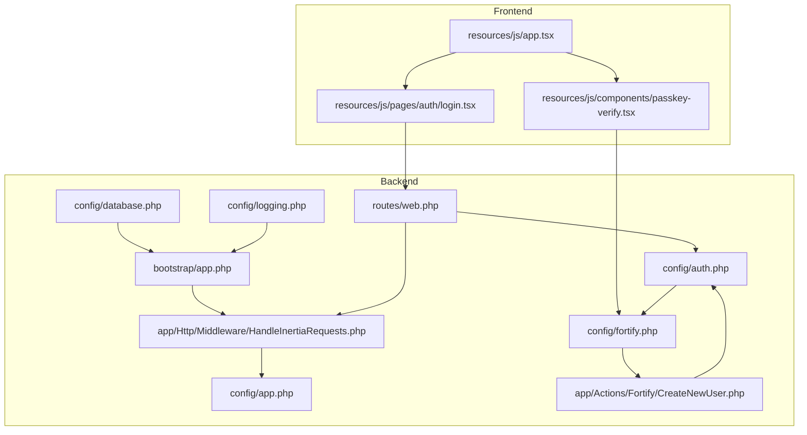
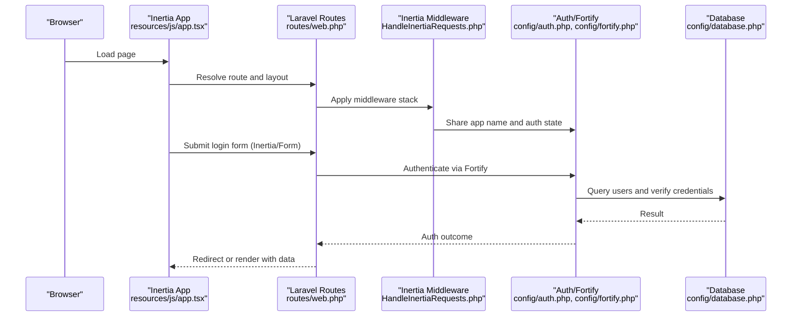
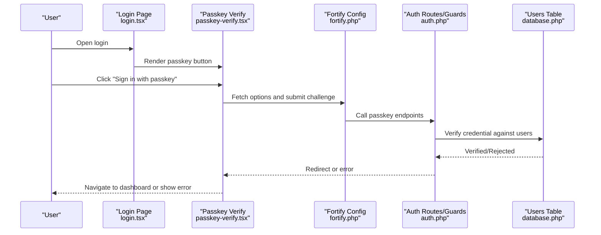
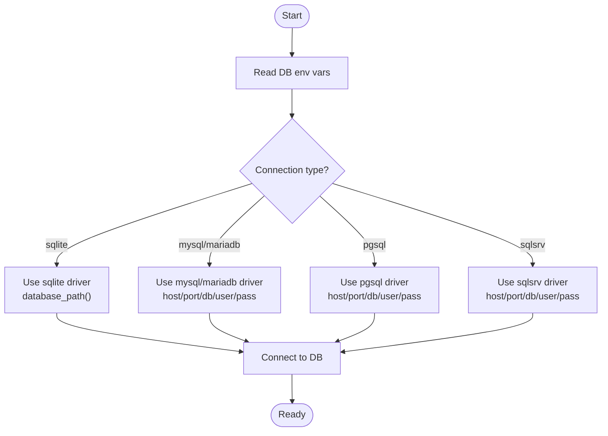
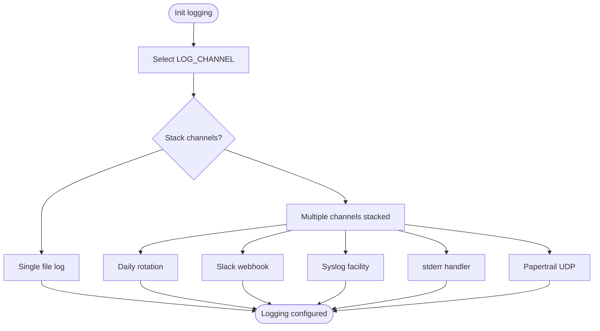
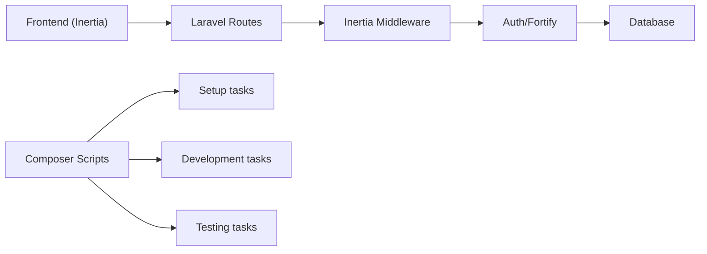

# Troubleshooting & FAQ

<cite>
**Referenced Files in This Document**
- [app.php](file://bootstrap/app.php)
- [HandleInertiaRequests.php](file://app/Http/Middleware/HandleInertiaRequests.php)
- [app.php](file://config/app.php)
- [auth.php](file://config/auth.php)
- [fortify.php](file://config/fortify.php)
- [database.php](file://config/database.php)
- [logging.php](file://config/logging.php)
- [composer.json](file://composer.json)
- [web.php](file://routes/web.php)
- [app.tsx](file://resources/js/app.tsx)
- [login.tsx](file://resources/js/pages/auth/login.tsx)
- [passkey-verify.tsx](file://resources/js/components/passkey-verify.tsx)
- [CreateNewUser.php](file://app/Actions/Fortify/CreateNewUser.php)
</cite>

## Table of Contents
1. [Introduction](#introduction)
2. [Project Structure](#project-structure)
3. [Core Components](#core-components)
4. [Architecture Overview](#architecture-overview)
5. [Detailed Component Analysis](#detailed-component-analysis)
6. [Dependency Analysis](#dependency-analysis)
7. [Performance Considerations](#performance-considerations)
8. [Troubleshooting Guide](#troubleshooting-guide)
9. [Conclusion](#conclusion)
10. [Appendices](#appendices)

## Introduction
This document provides a comprehensive troubleshooting and FAQ guide for ScholarGraph. It focuses on diagnosing and resolving common setup issues, authentication problems, database connection failures, and performance bottlenecks. It also covers debugging frontend/backend integration issues, API connectivity concerns, and AI service integration challenges. Guidance is grounded in the repository’s configuration and runtime behavior.

## Project Structure
ScholarGraph follows a Laravel backend with an Inertia.js/React frontend. The backend is configured via Laravel’s configuration files and bootstrapping, while the frontend uses Inertia to render pages and handle client-server communication.

**Diagram sources**
- [app.tsx:1-41](file://resources/js/app.tsx#L1-L41)
- [login.tsx:1-118](file://resources/js/pages/auth/login.tsx#L1-L118)
- [passkey-verify.tsx:1-75](file://resources/js/components/passkey-verify.tsx#L1-L75)
- [web.php:1-12](file://routes/web.php#L1-L12)
- [HandleInertiaRequests.php:1-48](file://app/Http/Middleware/HandleInertiaRequests.php#L1-L48)
- [app.php:1-31](file://bootstrap/app.php#L1-L31)
- [app.php:1-127](file://config/app.php#L1-L127)
- [auth.php:1-118](file://config/auth.php#L1-L118)
- [fortify.php:1-178](file://config/fortify.php#L1-L178)
- [database.php:1-185](file://config/database.php#L1-L185)
- [logging.php:1-133](file://config/logging.php#L1-L133)
- [CreateNewUser.php:1-34](file://app/Actions/Fortify/CreateNewUser.php#L1-L34)

**Section sources**
- [app.tsx:1-41](file://resources/js/app.tsx#L1-L41)
- [web.php:1-12](file://routes/web.php#L1-L12)
- [app.php:1-31](file://bootstrap/app.php#L1-L31)

## Core Components
- Application bootstrap and exception handling: Controls JSON error rendering for API routes and middleware registration.
- Inertia middleware: Shares application-wide data (name, auth state) and sets the root template.
- Authentication and Fortify: Defines guards, providers, passkeys, and two-factor features.
- Database configuration: Supports SQLite, MySQL, MariaDB, PostgreSQL, SQL Server; includes Redis options.
- Logging configuration: Provides stack, daily, Slack, syslog, stderr, and Papertrail channels.
- Composer scripts: Automates setup, development, testing, and type checking.

**Section sources**
- [app.php:26-30](file://bootstrap/app.php#L26-L30)
- [HandleInertiaRequests.php:36-46](file://app/Http/Middleware/HandleInertiaRequests.php#L36-L46)
- [auth.php:18-118](file://config/auth.php#L18-L118)
- [fortify.php:1-178](file://config/fortify.php#L1-L178)
- [database.php:20-185](file://config/database.php#L20-L185)
- [logging.php:21-133](file://config/logging.php#L21-L133)
- [composer.json:45-99](file://composer.json#L45-L99)

## Architecture Overview
The frontend initializes Inertia, selects layouts per route, and renders pages. Authentication integrates with Laravel Fortify and Inertia forms. Backend routes are protected by middleware and guarded by authentication policies.

**Diagram sources**
- [app.tsx:11-37](file://resources/js/app.tsx#L11-L37)
- [web.php:5-9](file://routes/web.php#L5-L9)
- [HandleInertiaRequests.php:17-46](file://app/Http/Middleware/HandleInertiaRequests.php#L17-L46)
- [auth.php:18-118](file://config/auth.php#L18-L118)
- [fortify.php:18-178](file://config/fortify.php#L18-L178)
- [database.php:35-115](file://config/database.php#L35-L115)

## Detailed Component Analysis

### Authentication and Passkeys
- Fortify configuration enables registration, password resets, email verification, two-factor, and passkeys.
- Passkeys rely on relying party ID derived from application URL and allowed origins.
- The login page integrates a passkey verification component that triggers Fortify endpoints.

**Diagram sources**
- [login.tsx:20-112](file://resources/js/pages/auth/login.tsx#L20-L112)
- [passkey-verify.tsx:26-36](file://resources/js/components/passkey-verify.tsx#L26-L36)
- [fortify.php:145-150](file://config/fortify.php#L145-L150)
- [auth.php:40-74](file://config/auth.php#L40-L74)
- [database.php:35-115](file://config/database.php#L35-L115)

**Section sources**
- [fortify.php:145-150](file://config/fortify.php#L145-L150)
- [login.tsx:20-112](file://resources/js/pages/auth/login.tsx#L20-L112)
- [passkey-verify.tsx:26-36](file://resources/js/components/passkey-verify.tsx#L26-L36)
- [auth.php:40-74](file://config/auth.php#L40-L74)

### Database Connectivity
- Default connection is SQLite unless overridden by environment variables.
- MySQL/MariaDB/PostgreSQL/SQL Server drivers are supported with configurable host, port, credentials, charset, collation, and SSL options.
- Redis options are available for default and cache databases.

**Diagram sources**
- [database.php:20-115](file://config/database.php#L20-L115)

**Section sources**
- [database.php:20-115](file://config/database.php#L20-L115)

### Logging and Monitoring
- Default channel selection and stack composition are configurable.
- Daily rotation, Slack, syslog, stderr, and Papertrail integrations are available.
- Deprecation logging can be enabled with optional stack tracing.

**Diagram sources**
- [logging.php:21-133](file://config/logging.php#L21-L133)

**Section sources**
- [logging.php:21-133](file://config/logging.php#L21-L133)

## Dependency Analysis
- Frontend depends on Inertia for page rendering and navigation.
- Backend routes are protected by authentication middleware and Fortify features.
- Composer scripts orchestrate setup, migration, build, and testing.

**Diagram sources**
- [app.tsx:11-37](file://resources/js/app.tsx#L11-L37)
- [web.php:5-9](file://routes/web.php#L5-L9)
- [HandleInertiaRequests.php:17-46](file://app/Http/Middleware/HandleInertiaRequests.php#L17-L46)
- [auth.php:18-118](file://config/auth.php#L18-L118)
- [fortify.php:18-178](file://config/fortify.php#L18-L178)
- [database.php:35-115](file://config/database.php#L35-L115)
- [composer.json:45-99](file://composer.json#L45-L99)

**Section sources**
- [composer.json:45-99](file://composer.json#L45-L99)
- [web.php:5-9](file://routes/web.php#L5-L9)

## Performance Considerations
- Prefer production-ready database drivers and connection pooling where applicable.
- Use daily or rotating logs to avoid large single log files.
- Minimize unnecessary middleware overhead; keep only required middleware in the stack.
- Monitor Redis retries and backoff settings if caching or queues are used.
- Enable appropriate log levels to reduce noise in production environments.

[No sources needed since this section provides general guidance]

## Troubleshooting Guide

### Setup and Installation
Common symptoms
- Blank page after initial load
- Build artifacts missing
- Environment key not generated

Diagnostic steps
- Verify environment variables and APP_KEY generation via Composer scripts.
- Confirm database file exists or remote DB is reachable.
- Ensure frontend assets are built and served.

Resolution strategies
- Run the setup script to install dependencies, generate keys, run migrations, and build assets.
- Check that APP_URL matches the deployed domain and APP_ENV is set appropriately.
- Validate database configuration and credentials.

**Section sources**
- [composer.json:46-53](file://composer.json#L46-L53)
- [app.php:29-55](file://config/app.php#L29-L55)
- [database.php:35-45](file://config/database.php#L35-L45)

### Authentication Problems
Common symptoms
- Login fails silently
- Passkey authentication does not appear or throws errors
- Two-factor or email verification not working

Diagnostic steps
- Inspect Fortify passkeys relying party ID and allowed origins derived from APP_URL.
- Verify authentication guard and provider configuration.
- Check that the user model and database schema match expectations.

Resolution strategies
- Ensure APP_URL is correctly set so passkeys derive proper RP ID and origins.
- Confirm Fortify features are enabled and routes are registered.
- Validate user creation process and password hashing rules.

**Section sources**
- [fortify.php:145-150](file://config/fortify.php#L145-L150)
- [auth.php:18-118](file://config/auth.php#L18-L118)
- [CreateNewUser.php:20-32](file://app/Actions/Fortify/CreateNewUser.php#L20-L32)

### Database Connection Issues
Common symptoms
- Application reports database connection errors
- Migrations fail or tables not found
- Redis connectivity problems

Diagnostic steps
- Confirm DB_CONNECTION and related environment variables.
- Verify driver-specific settings (host, port, credentials).
- Check Redis client configuration and cluster settings.

Resolution strategies
- Switch to a supported driver and update credentials.
- For SQLite, ensure the database file path is writable.
- For Redis, adjust retry/backoff settings and verify network connectivity.

**Section sources**
- [database.php:20-185](file://config/database.php#L20-L185)

### Frontend/Backend Integration Issues
Common symptoms
- Forms submit but page does not update
- Layout mismatch or missing shared data
- Navigation not handled by Inertia

Diagnostic steps
- Confirm Inertia root template and shared props are applied.
- Verify route names and middleware groups.
- Check that the frontend app initializes Inertia with correct layout mapping.

Resolution strategies
- Ensure HandleInertiaRequests shares required data and uses the correct root view.
- Align route names with frontend navigation helpers.
- Confirm APP_NAME and auth.user are propagated to the frontend.

**Section sources**
- [HandleInertiaRequests.php:17-46](file://app/Http/Middleware/HandleInertiaRequests.php#L17-L46)
- [web.php:5-9](file://routes/web.php#L5-L9)
- [app.tsx:11-37](file://resources/js/app.tsx#L11-L37)

### API Connectivity Problems
Common symptoms
- API endpoints return generic errors
- JSON responses expected but HTML fallbacks occur

Diagnostic steps
- Review exception handling configuration for JSON rendering on API routes.
- Confirm Accept headers and request formats.

Resolution strategies
- Ensure API routes are detected for JSON rendering or explicitly set headers.
- Centralize error rendering for predictable API responses.

**Section sources**
- [app.php:26-30](file://bootstrap/app.php#L26-L30)

### AI Service Integration Challenges
Note
- No explicit AI service integrations are present in the repository. If integrating external AI services, ensure:
  - Proper environment variable configuration
  - Robust error handling and fallbacks
  - Clear logging and observability around AI calls

Guidance
- Wrap AI calls with timeouts and retries.
- Log request/response payloads at debug level for diagnostics.
- Implement circuit breakers to prevent cascading failures.

[No sources needed since this section provides general guidance]

### Logging and Monitoring Approaches
Common symptoms
- Excessive logs or insufficient visibility
- Logs not reaching external systems

Diagnostic steps
- Verify LOG_CHANNEL and stack composition.
- Check daily rotation, Slack webhook URL, Papertrail host/port, and syslog facility.
- Confirm deprecation logging settings.

Resolution strategies
- Use daily rotation for production logs.
- Configure Slack/Papertrail/syslog according to infrastructure.
- Adjust log levels to balance verbosity and performance.

**Section sources**
- [logging.php:21-133](file://config/logging.php#L21-L133)

### Community Support and Escalation
- Use repository scripts for local development and testing.
- Leverage testing frameworks and static analysis as part of CI checks.
- For environment-specific issues, consult the logging configuration and database settings.

**Section sources**
- [composer.json:74-79](file://composer.json#L74-L79)
- [logging.php:21-133](file://config/logging.php#L21-L133)
- [database.php:20-115](file://config/database.php#L20-L115)

## Conclusion
This guide consolidates practical troubleshooting methodologies for ScholarGraph, focusing on setup, authentication, database connectivity, frontend/backend integration, API behavior, and logging. By aligning configuration with environment variables and leveraging the provided scripts and middleware, most issues can be diagnosed and resolved systematically.

[No sources needed since this section summarizes without analyzing specific files]

## Appendices

### Frequently Asked Questions
Q: Why is my login page blank?
- Ensure APP_KEY is generated and environment variables are loaded. Re-run setup if needed.

Q: How do I enable passkey login?
- Confirm APP_URL is set correctly so passkeys derive proper relying party settings.

Q: How do I connect to MySQL/MariaDB/PostgreSQL/SQL Server?
- Set DB_CONNECTION and related variables; verify host, port, credentials, charset, and SSL options.

Q: How do I rotate logs?
- Set LOG_CHANNEL to daily and adjust days retention.

Q: How do I force JSON responses for API routes?
- Rely on the centralized exception handling that detects API routes and JSON expectations.

**Section sources**
- [composer.json:46-53](file://composer.json#L46-L53)
- [app.php:29-55](file://config/app.php#L29-L55)
- [fortify.php:145-150](file://config/fortify.php#L145-L150)
- [database.php:20-115](file://config/database.php#L20-L115)
- [logging.php:68-74](file://config/logging.php#L68-L74)
- [app.php:26-30](file://bootstrap/app.php#L26-L30)